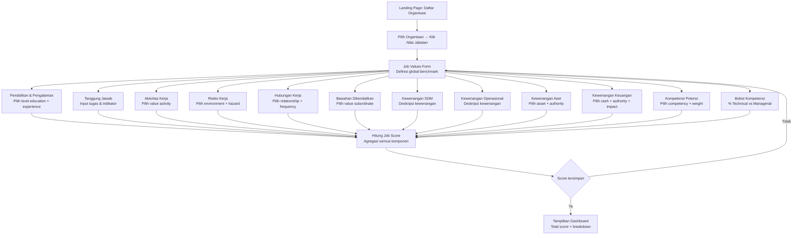

# Job Management Module — Analisis & Rencana Implementasi Frontend

> 🔗 **Arsip dokumentasi:** [`docs/README.md`](../README.md) — dokumen ini adalah referensi historis dari modul yang sudah selesai diimplementasikan.


**Generated:** 30 July 2026  
**Updated:** 05 August 2026  
**Source:** `backend/internal/modules/jobmanagement/` (Go) + analisis model scoring  
> **Update 05 Agu 2026:** scoring otomatis sudah diimplementasikan (lihat G.7), form per-org
> `JobManagementForm.vue` selesai (multi-section dengan left-nav + sticky score summary),
> Job Values + mapping cluster + tree endpoint selesai. Lihat juga
> `docs/job-management-score-analysis.md` (status implementasi) & `docs/project-completion-dashboard.md`.

---

## A. Ringkasan Arsitektur

### Old App (Laravel — `inthros-web`)
```
Route::prefix('jobs-management')
  ├── GET  /dashboard                  → Dashboard
  ├── GET  /                           → Index (list all organizations)
  ├── GET  /add                        → Add new (create job data for org)
  ├── GET  /{organizationId}           → Edit (manage ALL job data per org)
  ├── GET  /export/pdf                 → Export PDF
  ├── GET  /export/excel               → Export Excel
  ├── GET  /{organizationId}/report/pdf   → Position Report PDF
  ├── GET  /{organizationId}/report/excel → Position Report Excel
  ├── GET  job-management-titles       → Get titles (AJAX)
  │
  │   ── Sub-entities (semua per-organization) ──
  ├── PUT  /{orgId}/identification           → Update Identitas Jabatan
  ├── PUT  /{orgId}/objective                → Update Tujuan Jabatan
  ├── PUT  /{orgId}/education-experience     → Update Pendidikan & Pengalaman
  ├── PUT  /{orgId}/hr-authorities           → Update Kewenangan SDM
  ├── PUT  /{orgId}/operational-authorities  → Update Kewenangan Operasional
  ├── PUT  /{orgId}/working-activity         → Update Aktivitas Kerja
  ├── PUT  /{orgId}/working-risk             → Update Risiko Kerja
  ├── PUT  /{orgId}/financial-authority      → Update Kewenangan Keuangan
  ├── PUT  /{orgId}/asset-authority          → Update Kewenangan Aset
  ├── PUT  /{orgId}/subordinate-control      → Update Bawahan Dikendalikan
  ├── PUT  /{orgId}/relationships            → Update Hubungan Kerja
  ├── PUT  /{orgId}/potency-competencies     → Update Kompetensi Potensi
  ├── POST /{orgId}/responsibilities         → Store Tanggung Jawab
  ├── PUT  /{orgId}/responsibilities/{id}    → Update Tanggung Jawab
  └── DELETE /{orgId}/responsibilities/{id}  → Delete Tanggung Jawab
```

### Current App (Go — HRIS Backend)
```
Route::prefix('job-management')
  ├── Titles (9.1)          — CRUD (global, not per-org)
  ├── Title Subs (9.2)      — CRUD nested under titles
  ├── Values (9.3)          — CRUD (global) ✅ Frontend done
  ├── Objectives (9.4)      — CRUD (per-org via OrganizationID)
  ├── Identifications (9.5) — CRUD (per-org via OrganizationID)
  ├── Responsibilities (9.6)— CRUD (per-org via OrganizationID)
  ├── Education Exp (9.7)   — CRUD (per-org via OrganizationID)
  ├── HR Authorities (9.8)  — CRUD (per-org via OrganizationID)
  ├── Operational Auth (9.9)— CRUD (per-org via OrganizationID)
  ├── Working Activities(9.10)— CRUD (per-org via OrganizationID)
  ├── Working Risks (9.11)  — CRUD (per-org via OrganizationID)
  ├── Relationships (9.12)  — CRUD (per-org via OrganizationID)
  ├── Subordinate Control(9.13)— CRUD (per-org via OrganizationID)
  ├── Assets (9.14)         — CRUD (per-org via OrganizationID)
  ├── Financials (9.15)     — CRUD (per-org via OrganizationID)
  ├── Potency Comp (9.16)   — CRUD (per-org via OrganizationID)
  ├── Scores (9.17)         — READ + Upsert (per-org)
  └── Competency Groups(9.18)— CRUD (per-org via OrganizationID)
```

---

## B. Gap Analysis: Old vs Current

| Aspek | Laravel (Old) | Go Backend (Current) | Status |
|-------|:-------------:|:--------------------:|:------:|
| **Alur navigasi** | Pilih org → Edit semua sub-entity per org | Pilih org → landing page → per entity page | ✅ Already implemented landing page |
| **Sub-entity per org** | Semua PUT /{orgId}/xxx | Semua sudah punya OrganizationID field | ✅ Backend ready |
| **Dashboard** | Ada dashboard khusus jobs | Belum ada | ⬜ Missing |
| **Global entity (Titles/Values)** | Ada (job-management-titles) | Ada Titles + Values CRUD | ✅ Backend ready |
| **Frontend** | Blade view terintegrasi | Vue 3 component terpisah | 🟡 Partial |
| **Export PDF/Excel** | Ada 4 endpoint export | Belum ada | ⬜ Missing |
| **Responsibilities CRUD** | POST/PUT/DELETE nested | CRUD standar 5 endpoint | ✅ Backend ready |

---

## C. Frontend Implementation Plan

### Phase 1: ✅ Done — Landing Page
| Task | Status |
|------|:------:|
| Landing page daftar organisasi (active_only) | ✅ **Done** |
| Navigasi ke Nilai Jabatan (Job Values) | ✅ **Done** |
| Job Values CRUD form page | ✅ **Done** |

### Phase 2: ✅ DONE — Complete Organization-based Sub-entities
Buat form lengkap per organisasi dengan multi-step/tab layout (seperti EmployeeForm):

| No | Sub-entity | Backend Slug | Endpoint Group | Priority | Frontend View |
|:--:|------------|:------------:|:--------------:|:--------:|:-------------:|
| 1 | **Job Titles** | `titles` | `/job-management/titles` | 🟢 High | ✅ via JobManagementForm (tab global) |
| 2 | **Job Values** | `values` | `/job-management/values` | ✅ **Done** | `JobValuesIndex.vue` + tree/clusters endpoint |
| 3 | **Job Objectives** | `objectives` | `/job-management/objectives` | 🟢 High | ✅ `JobObjectiveSection.vue` |
| 4 | **Job Identifications** | `identifications` | `/job-management/identifications` | 🟢 High | ✅ `JobIdentificationSection.vue` |
| 5 | **Responsibilities** | `responsibilities` | `/job-management/responsibilities` | 🟢 High | ✅ `JobResponsibilitySection.vue` |
| 6 | **Education Experiences** | `education-experiences` | `/job-management/education-experiences` | 🟡 Medium | ✅ `JobEduExpSection.vue` (multiple major/family) |
| 7 | **HR Authorities** | `hr-authorities` | `/job-management/hr-authorities` | 🟡 Medium | ✅ `JobHRAuthoritySection.vue` |
| 8 | **Operational Authorities** | `operational-authorities` | `/job-management/operational-authorities` | 🟡 Medium | ✅ `JobOpAuthoritySection.vue` |
| 9 | **Working Activities** | `working-activities` | `/job-management/working-activities` | 🟡 Medium | ✅ `JobActivitySection.vue` (langsung form) |
| 10 | **Working Risks** | `working-risks` | `/job-management/working-risks` | 🟡 Medium | ✅ `JobRiskSection.vue` (langsung form) |
| 11 | **Relationships** | `relationships` | `/job-management/relationships` | 🟡 Medium | ✅ `JobRelationshipSection.vue` (scope/frequency + detail tabel) |
| 12 | **Subordinate Controls** | `subordinate-controls` | `/job-management/subordinate-controls` | 🟡 Medium | ✅ `JobSubordinateSection.vue` (langsung form) |
| 13 | **Assets** | `assets` | `/job-management/assets` | 🟡 Medium | ✅ `JobAssetSection.vue` (langsung form) |
| 14 | **Financials** | `financials` | `/job-management/financials` | 🟡 Medium | ✅ `JobFinancialSection.vue` (langsung form, authority switch) |
| 15 | **Potency Competencies** | `potency-competencies` | `/job-management/potency-competencies` | 🟡 Medium | ✅ `JobPotencySection.vue` (5 card + bobot) |
| 16 | **Job Scores** | `scores` | `/job-management/scores` | 🟢 High | ✅ `JobScoreSection.vue` + `JobScoreSummary.vue` sticky |
| 17 | **Competency Groups** | `competency-groups` | `/job-management/competency-groups` | 🟡 Medium | ✅ bobot di card Technical/Managerial |

### Phase 3: 🟡 Dashboard & Reports (sebagian)
| Task | Priority | Status |
|------|:--------:|:------:|
| Jobs Management Dashboard (KPI: total orgs, titles, values, scores) | 🟡 Medium | 🔶 Belum (score per-org tampil di daftar) |
| Export PDF per organization | 🟢 Low | ⬜ TODO |
| Export Excel per organization | 🟢 Low | ⬜ TODO |

---

## D. Proposed Frontend Architecture

### D.1. Layout Pattern (mengikuti EmployeeForm)

```
┌─────────────────────────────────────────────────┐
│  Header: Organization Name / Full Code          │
├──────────┬──────────────────────────────────────┤
│ Left     │ Right: Form Content                  │
│ Nav      │                                      │
│          │  ┌─────────────────────────────────┐ │
│ ← Back   │  │ DataTable + Dialog CRUD        │ │
│          │  │ atau Single Form               │ │
│ Org Info │  │ (tergantung sub-entity)         │ │
│          │  └─────────────────────────────────┘ │
│ Active   │                                      │
│ Section  │                                      │
└──────────┴──────────────────────────────────────┘
```

### D.2. Route Structure

```js
// Router tenant
{
  path: 'job-management',
  name: 'JobManagement',
  component: JobManagement.vue,    // Landing page — daftar orgs ✅ Done
  meta: { module: 'jobmanagement' }
},
{
  path: 'job-management/values',
  name: 'JobValues',
  component: JobValuesForm.vue,    // Job Values CRUD ✅ Done
  meta: { module: 'jobmanagement', backRoute: '/job-management' }
},
// ... sisanya mengikuti pattern yang sama:
{
  path: 'job-management/:section',
  name: 'JobSection',
  component: dynamic,
  meta: { module: 'jobmanagement', backRoute: '/job-management' }
}
```

### D.3. Perbedaan Entity Type

| Type | Entities | Frontend Pattern |
|:----:|----------|:----------------:|
| **Global** | Titles, Values | Simple DataTable CRUD (seperti Settings) |
| **Per-Org** | Objectives, Identifications, Responsibilities, dll | DataTable filtered by org_id + per-item dialog CRUD |
| **Single per-org** | Scores, Edu-Exp, HRAuthority, dll | Single form per organization (PUT) — mengikuti pattern lama Laravel |

---

## E. Catatan Penting

1. **Alur kerja Laravel lama:** User pilih organisasi → langsung ke halaman edit dengan 13 section PUT (identification, objective, working-activity, dll). Semua disimpan per section dengan PUT terpisah.
2. **Alur Go backend saat ini:** Setiap entity punya CRUD mandiri (POST/GET/PUT/DELETE). Ini lebih fleksibel.
3. **Frontend yang sudah ada:** Landing page ✅, Job Values CRUD ✅. Sisanya 16 entity belum ada frontend.
4. **Backend sudah siap:** Semua entity sudah punya handler, service, repository, routes lengkap (**96 endpoint** — +tree/clusters/details, 100 service methods).
5. **Dashboard & Reports:** Tersedia di old app tapi belum ada di Go backend.

---

---

## F. Prioritas Eksekusi

| Priority | Feature | Estimasi | Status |
|:--------:|---------|:--------:|:------:|
| P0 | Landing Page (org list) | 🟢 1 hari | ✅ Done |
| P0 | Job Values CRUD Form | 🟢 1 hari | ✅ Done |
| P1 | Job Titles CRUD + Title Subs | 🟡 2 hari | ⬜ TODO |
| P1 | Job Objectives + Identifications | 🟡 2 hari | ⬜ TODO |
| P1 | Responsibilities (multi-row) | 🟡 2 hari | ⬜ TODO |
| P2 | Remaining 12 entities | 🔴 5-7 hari | ⬜ TODO |
| P3 | Jobs Dashboard + Reports | 🔴 3 hari | ⬜ TODO |

---

## G. Analisis Logika Perhitungan (Job Scoring)

### G.1. Konsep Dasar

Job Management memiliki sistem **scoring/point-based** untuk menghitung **Nilai Jabatan (Job Value)** setiap posisi (organisasi). Sistem ini terdiri dari 3 layer:

```
Layer 1: Job Values (Global Benchmark)
         ↓ Referensi (foreign key)
Layer 2: Per-Org Entities (per posisi)
         ↓ Agregasi
Layer 3: Job Score (Hasil Akhir)
```

### G.2. Layer 1 — Job Values (Nilai Jabatan)

**Model:** `JobValue` → table `job_management_values`

Ini adalah data **global benchmark** yang menjadi acuan penilaian. Setiap Job Value memiliki:

| Field | Tipe | Deskripsi |
|-------|:----:|-----------|
| `type` | `string` | **Kategori nilai** — kunci utama scoring |
| `level` | `*int` | **Tingkat/level** (1-5), makin tinggi makin besar bobot |
| `descriptions` | `*text` | Deskripsi level (mis: "SMA/Sederajat" untuk education level 1) |
| `note` | `*text` | Catatan tambahan |
| `sort` | `*int` | Urutan tampilan |

#### Daftar Tipe (type) Job Value

Berdasarkan foreign key references di per-org entities, berikut tipe-tipe Job Value yang digunakan:

| Tipe | Digunakan Oleh | Fungsi |
|:----:|---------------|--------|
| `education` | Education Experiences | Level pendidikan yang dibutuhkan |
| `experience` | Education Experiences | Level pengalaman kerja yang dibutuhkan |
| `environment` | Working Risks | Level risiko lingkungan kerja |
| `hazard` | Working Risks | Level risiko bahaya kerja |
| `relationship` | Relationships | Tingkat kompleksitas hubungan kerja |
| `frequency` | Relationships | Frekuensi hubungan kerja |
| `cash` | Financials | Level wewenang cash/keuangan |
| `authority` | Financials, Assets | Level kewenangan |
| `impact` | Financials | Level dampak keputusan keuangan |
| `asset` | Assets | Level tanggung jawab aset |
| *(other)* | Subordinate Controls, Working Activities, Potency Competencies | Tergantung implementasi |

**Contoh Data Job Value:**
```json
[
  { "type": "education", "level": 1, "descriptions": "SMA/Sederajat", "sort": 1 },
  { "type": "education", "level": 2, "descriptions": "D3", "sort": 2 },
  { "type": "education", "level": 3, "descriptions": "S1", "sort": 3 },
  { "type": "experience", "level": 1, "descriptions": "< 1 tahun", "sort": 1 },
  { "type": "experience", "level": 2, "descriptions": "1-3 tahun", "sort": 2 },
  { "type": "environment", "level": 1, "descriptions": "Lingkungan kantor normal", "sort": 1 }
]
```

### G.3. Layer 2 — Per-Organization Entities

Setiap posisi (organisasi) memiliki data di 12+ entity yang **mereferensi Job Values**. Hubungannya:

```
Entity Per-Org                → Referensi Job Value (type)
─────────────────────────────────────────────────────────
JobEducationExperience        → education_id, experience_id
JobWorkingActivity            → value_id (activity type)
JobWorkingRisk                → environment_id, hazard_id
JobRelationship               → relationship_id, frequency_id
JobSubordinateControl         → value_id (control type)
JobHRAuthority                → description field (text, not reference)
JobOperationalAuthority       → description field (text, not reference)
JobAsset                      → asset_id, authority_id
JobFinancial                  → cash_id, authority_id, impact_id
JobPotencyCompetency          → value_id + competency_id + weight
JobCompetencyGroup            → category ("technical"/"managerial") + weight
```

#### Alur Input Data per Organisasi

```mermaid
flowchart TD
    A[Pilih Organisasi] --> B[Isi Identitas Jabatan]
    A --> C[Isi Tujuan Jabatan]
    A --> D[Isi Pendidikan & Pengalaman]
    D --> D1[Pilih Job Value: education]
    D --> D2[Pilih Job Value: experience]
    A --> E[Isi Tanggung Jawab]
    A --> F[Isi Kewenangan SDM]
    A --> G[Isi Kewenangan Operasional]
    A --> H[Isi Aktivitas Kerja]
    H --> H1[Pilih Job Value: activity]
    A --> I[Isi Risiko Kerja]
    I --> I1[Pilih Job Value: environment]
    I --> I2[Pilih Job Value: hazard]
    A --> J[Isi Hubungan Kerja]
    J --> J1[Pilih Job Value: relationship]
    J --> J2[Pilih Job Value: frequency]
    A --> K[Isi Bawahan Dikendalikan]
    K --> K1[Pilih Job Value: control]
    A --> L[Isi Kewenangan Aset]
    L --> L1[Pilih Job Value: asset]
    L --> L2[Pilih Job Value: authority]
    A --> M[Isi Kewenangan Keuangan]
    M --> M1[Pilih Job Value: cash]
    M --> M2[Pilih Job Value: authority]
    M --> M3[Pilih Job Value: impact]
    A --> N[Isi Kompetensi Potensi]
    N --> N1[Pilih Job Value + Competency + Weight]
    A --> O[Buat Bobot Kompetensi]
    O --> O1[Tentukan % Technical vs Managerial]
```



### G.4. Layer 3 — Job Score Calculation

**Model:** `JobScore` → table `job_management_scores`

Setiap organisasi memiliki **1 record Job Score** (unique index on organization_id). Nilai ini dihitung dari agregasi semua per-org entities.

#### Field Output

| Field | Tipe | Deskripsi |
|-------|:----:|-----------|
| `job_value_with_financial` | `uint64` | **Total nilai jabatan** DENGAN memasukkan komponen keuangan |
| `job_value_without_financial` | `uint64` | Total nilai jabatan TANPA komponen keuangan |
| `has_financial_authority` | `bool` | Apakah posisi memiliki wewenang keuangan? |
| `components` | `*json` | Rincian skor per komponen (JSON) |
| `sub_component_points` | `*json` | Rincian skor per sub-komponen (JSON) |
| `calculated_at` | `*time` | Waktu perhitungan terakhir |

#### Rumus Perhitungan

```
// Step 1: Hitung skor per komponen (mapping dari level ke points)
// Setiap level memiliki titik (points) yang sudah ditentukan

// Component: Pendidikan (max X points)
education_points  = education_level * WEIGHT_EDUCATION

// Component: Pengalaman (max Y points)
experience_points = experience_level * WEIGHT_EXPERIENCE

// Component: Lingkungan Kerja (max Z points)
environment_points = environment_level * WEIGHT_ENVIRONMENT

// Component: Risiko Bahaya
hazard_points = hazard_level * WEIGHT_HAZARD

// Component: Hubungan Kerja
relationship_points = relationship_level * WEIGHT_RELATIONSHIP
frequency_points    = frequency_level * WEIGHT_FREQUENCY

// Component: Bawahan
subordinate_points  = subordinate_level * WEIGHT_SUBORDINATE

// Component: Kewenangan
hr_authority_points    = hr_authority_level * WEIGHT_HR_AUTH
operational_auth_points = operational_auth_level * WEIGHT_OP_AUTH

// Component: Aset
asset_points      = asset_level * WEIGHT_ASSET
asset_auth_points  = asset_authority_level * WEIGHT_ASSET_AUTH

// Step 2: Hitung Job Value WITHOUT Financial
job_value_without_financial =
    education_points + experience_points +
    environment_points + hazard_points +
    relationship_points + frequency_points +
    subordinate_points +
    hr_authority_points + operational_auth_points +
    asset_points + asset_auth_points

// Step 3: Hitung komponen keuangan (jika ada)
cash_points       = cash_level * WEIGHT_CASH
fin_authority_points = fin_authority_level * WEIGHT_FIN_AUTH
impact_points     = impact_level * WEIGHT_IMPACT

financial_components_total = cash_points + fin_authority_points + impact_points

// Step 4: Hitung Job Value WITH Financial
job_value_with_financial = job_value_without_financial + financial_components_total

// Step 5: Tentukan apakah posisi memiliki wewenang keuangan
has_financial_authority = (fin_authority_level > 0)

// Step 6: Simpan komponen detail sebagai JSON
components = {
  "pendidikan": education_points,
  "pengalaman": experience_points,
  "lingkungan_kerja": environment_points,
  "risiko_bahaya": hazard_points,
  "hubungan_kerja": relationship_points + frequency_points,
  "bawahan": subordinate_points,
  "kewenangan_sdm": hr_authority_points,
  "kewenangan_operasional": operational_auth_points,
  "aset": asset_points + asset_auth_points,
  "keuangan": financial_components_total
}

sub_component_points = {
  "pendidikan": { "level": education_level, "points": education_points },
  "pengalaman": { "level": experience_level, "points": experience_points },
  // ... dan seterusnya
}
```

### G.5. Kompetensi & Bobot

#### Competency Groups (Bobot Kompetensi)

Setiap organisasi bisa punya 2 kategori bobot:

| Category | Deskripsi | Contoh Bobot |
|:--------:|-----------|:------------:|
| `technical` | Kompetensi Teknis | 60% |
| `managerial` | Kompetensi Manajerial | 40% |

Bobot ini digunakan untuk menghitung **kompetensi potensi** (Potency Competencies) per organisasi:

```
// Technical weight
Σ(technical_competency_weight × value_weight) / Σ(technical_max_weight)

// Managerial weight
Σ(managerial_competency_weight × value_weight) / Σ(managerial_max_weight)

// Final competency score
final = (technical_score × technical_group_weight%) + (managerial_score × managerial_group_weight%)
```

### G.6. Alur End-to-End (User Flow)



### G.7. Catatan Implementasi Backend Saat Ini — UPDATE 05 Agu 2026

1. ✅ **Job Score OTOMATIS** — `calculator.go` (port penuh `JobValueCalculator.php`) dihitung
   ulang otomatis setiap section yang memengaruhi skor disimpan (hook `recalculateScore` di
   Create/Update/Delete education-experiences, potency-competencies, financials, assets,
   subordinate-controls, relationships, working-activities, working-risks) — hasil disimpan ke
   `job_management_scores` termasuk `is_complete`/`completed_at` (migration 051).
   Endpoint `PUT /job-management/scores/org/:orgId` tetap ada untuk recalculate manual
   (body kosong = hitung ulang).

2. **Components & SubComponentPoints** — Disimpan sebagai JSON string (`*string` dengan `gorm:"type:json"`). Frontend perlu menyusun JSON ini sebelum dikirim.

3. **Setiap Job Value type bersifat independen** — Tidak ada constraint yang memastikan konsistensi (mis: education level 4 tidak valid jika tidak ada Job Value dengan type='education' level 4).

4. **Potency Competencies** — Mereferensi entity `competency` dari module Competency (module terpisah). Frontend perlu fetch dari module Competency untuk dropdown.

5. **Grading** — `JobIdentification` memiliki `grading_id` yang mereferensi `settings/gradings`. Frontend perlu fetch dari Settings module.

6. **Job Titles & Title Subs** — Bersifat **global** (tidak per-org), tapi digunakan oleh Job Values (`job_management_title_sub_id`). Frontend perlu memuat data titles saat form Job Values.

### G.8. Rekomendasi Alur Frontend untuk Form Per-Org

Mengikuti pola **single-page multi-section** seperti form employee (bukan navigasi per entity page):

1. User pilih organisasi di landing page
2. Buka halaman form lengkap dengan left-nav sidebar:
   - Identitas Jabatan
   - Tujuan Jabatan
   - Pendidikan & Pengalaman
   - Tanggung Jawab
   - Kewenangan (SDM, Operasional, Keuangan, Aset)
   - Aktivitas & Risiko Kerja
   - Hubungan Kerja & Bawahan
   - Kompetensi Potensi & Bobot
   - **Skor Jabatan (Hasil Perhitungan)**
3. Setiap section menyimpan data independen ke endpoint masing-masing
4. Tombol "Hitung Skor" mengagregasi semua data dan mengirim ke Upsert Job Score

Alternatif: buat halaman per-section (seperti yang sudah dilakukan untuk Job Values) jika lebih sederhana.

Properti yang dipilih: **Single Page Multi-Section** — lebih mirip dengan Laravel lama, UX lebih baik karena user bisa melihat progress pengisian.
