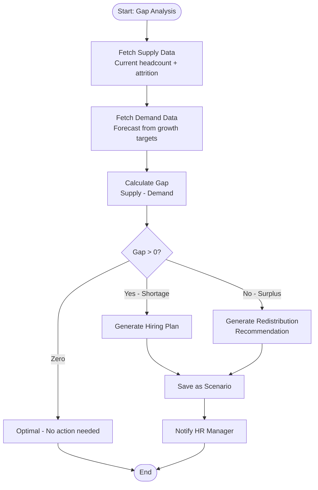
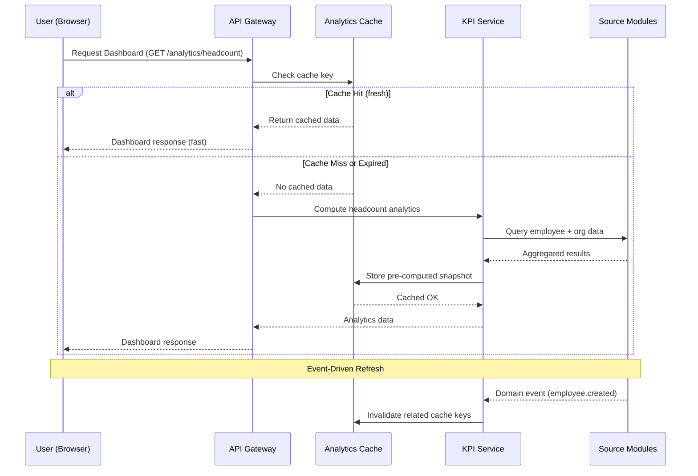

# Workforce Intelligence & Strategic Workforce Planning — Module Design

> 🔗 **Arsip dokumentasi:** [`docs/README.md`](../README.md) — dokumen ini adalah referensi historis dari modul yang sudah selesai diimplementasikan.


**Document Version:** 1.0
**Status:** Draft for Review
**Module Slug:** `workforce-intelligence`
**Module Priority:** Phase 5 — Strategic Analytics Layer

---

## 1. Executive Summary

The **Workforce Intelligence & Strategic Workforce Planning** module is the **strategic analytics layer** of the HRIS platform. It does **not** replace any existing operational module. Instead, it reads and aggregates data from all existing modules to provide dashboards, forecasts, simulations, and insights for HR, managers, and executives.

### Core Principles

| Principle | Description |
|-----------|-------------|
| **Read-Only** | Never writes to operational module tables |
| **Cached Aggregates** | Pre-computed snapshots for dashboard performance |
| **Event-Driven Refresh** | Listens to domain events to invalidate/refresh analytics |
| **Dashboard First** | Every feature starts as a dashboard widget |
| **Strategic Layer** | Designed for decision support, not operational transactions |

---

## 2. Architecture & Integration

```
┌──────────────────────────────────────────────────────────────────┐
│                  WORKFORCE INTELLIGENCE MODULE                    │
│  ┌─────────┐ ┌──────────┐ ┌──────────┐ ┌──────────┐ ┌────────┐ │
│  │Planning │ │Analytics │ │Capacity  │ │Cost      │ │Risk    │ │
│  │Dashboards│ │Engine    │ │Monitor   │ │Analytics │ │Monitor │ │
│  └────┬────┘ └────┬─────┘ └────┬─────┘ └────┬─────┘ └───┬────┘ │
│       │            │            │             │            │       │
│  ┌────┴────────────┴────────────┴─────────────┴────────────┴───┐ │
│  │               Analytics Cache (pre-computed aggregates)     │ │
│  └────────────────────────────┬────────────────────────────────┘ │
│                               │                                   │
│  ┌────────────────────────────┴────────────────────────────────┐ │
│  │              Event Bus — Subscriber                          │ │
│  │  (Listens to: employee.created, payroll.computed, etc.)     │ │
│  └─────────────────────────────────────────────────────────────┘ │
└──────────────────────────────────────────────────────────────────┘
           │              │              │               │
           ▼              ▼              ▼               ▼
┌──────────┐ ┌──────────┐ ┌──────────┐ ┌──────────────┐ ┌──────────┐
│Employee  │ │Payroll   │ │Attendance│ │Organization   │ │Recruit.  │
│Module    │ │Module    │ │Module    │ │Module         │ │Module    │
└──────────┘ └──────────┘ └──────────┘ └──────────────┘ └──────────┘
┌──────────┐ ┌──────────┐ ┌──────────┐ ┌──────────────┐ ┌──────────┐
│Leave     │ │Performa. │ │Training  │ │Competency     │ │Movement  │
│Module    │ │Module    │ │Module    │ │Module         │ │Module    │
└──────────┘ └──────────┘ └──────────┘ └──────────────┘ └──────────┘
```

### Data Source Mapping

| Dashboard / Feature | Source Module | Key Entities Used |
|--------------------|--------------|-------------------|
| Headcount Analytics | Employee, Organization | employees, organizations |
| Attendance Analytics | Attendance | attendance_sessions, attendance_events |
| Leave Analytics | Leave | leave_requests, leave_balances |
| Overtime Analytics | Attendance | attendance_overtime_requests |
| Payroll Analytics | Payroll | payroll_runs, payroll_payslips, salary_components |
| Performance Analytics | Performance | performance_evaluations, performance_scores |
| Learning Analytics | Training | training_participants, training_evaluations, training_certificates |
| Recruitment Analytics | Recruitment | job_applications, candidates, interviews |
| Employee Movement Analytics | Employee Movement | employee_movements, employee_contracts |
| Workforce Cost | Payroll | payroll_payslips, salary_employee_components |
| Competency Gap | Competency | competency_scores, competency_score_details |
| Risk Indicators | All modules | Aggregated from multiple sources |

---

## 3. Submodules & Features

### 3.1 Workforce Planning

**Purpose:** Strategic headcount planning and forecasting

| Feature | Description | Source Data |
|---------|-------------|-------------|
| Headcount Planning | Planned vs Actual headcount per department | Employee, Organization |
| Demand Forecasting | Forecast SDM kebutuhan berdasarkan growth target | Organization, historical trends |
| Supply Forecasting | Projected headcount from current employees + attrition | Employee, Movement |
| Gap Analysis | Supply - Demand = hiring need | Planning engine |
| Hiring Projection | Number of hires needed per quarter/role | Gap analysis output |
| Retirement Projection | Expected retirements in 1/3/5 years | Employee (age data) |
| Budget Projection | Cost projection based on planned headcount | Planning + Payroll |

### 3.2 Workforce Intelligence (KPI Dashboards)

**Real-time KPI widgets:**

| KPI | Formula | Update Frequency |
|-----|---------|-----------------|
| Total Employee | COUNT(active employees) | Real-time |
| Headcount Growth | (Current - Previous) / Previous % | Daily |
| Attrition Rate | (Resigned / Avg Headcount) × 100 | Monthly |
| Turnover Rate | (Resigned + Terminated) / Avg HC × 100 | Monthly |
| Retention Rate | 1 - Attrition Rate | Monthly |
| Promotion Rate | (Promoted / Total HC) × 100 | Quarterly |
| Internal Mobility | (Internal Moves / Total HC) × 100 | Quarterly |
| Average Tenure | AVG(DATEDIFF(today, hire_date)) | Daily |
| Diversity Ratio | By gender, generation, etc. | Daily |
| Employment Type Dist | PKWT vs PKWTT vs Daily % | Daily |

### 3.3 Workforce Analytics

**Drill-down dashboards for each operational domain:**

| Dashboard | Metrics | Drill-Down Path |
|-----------|---------|----------------|
| Headcount Analytics | HC by dept, branch, position, type | Company → Branch → Dept → Position |
| Attendance Analytics | Avg attendance %, late %, absent % | Dept → Employee → Date |
| Leave Analytics | Leave taken, remaining, by type | Dept → Employee → Leave Type |
| Overtime Analytics | OT hours/cost, by dept, trend | Dept → Month → Employee |
| Payroll Analytics | Total payroll, avg salary, by level | Company → Dept → Grade |
| Performance Analytics | Avg score, distribution, trend | Period → Dept → Employee |
| Learning Analytics | Completion %, avg score, hours | Course → Dept → Employee |
| Recruitment Analytics | Time-to-hire, cost-per-hire, source | Requisition → Source → Candidate |
| Movement Analytics | Promotion %, mutation count | Period → Dept → Type |

### 3.4 Workforce Capacity & Utilization

| Feature | Description | Calculation |
|---------|-------------|-------------|
| Utilization Rate | Active work hours / Available hours × 100 | From Attendance + Work config |
| Capacity Forecast | Projected available capacity | Based on headcount forecast |
| Resource Distribution | HC allocation across departments | Organization structure |
| Bottleneck Analysis | Departments with utilization > 85% | Utilization data |
| Team Utilization | Per-team breakdown | Organization + Attendance |

### 3.5 Workforce Cost Analytics

| Dashboard | Metrics | Source |
|-----------|---------|--------|
| Payroll Cost | Total salary + benefits per period | Payroll |
| Labor Cost per Employee | Total cost / Active HC | Payroll + Employee |
| Cost per Department | Department cost breakdown | Payroll + Organization |
| Budget vs Actual | Planned vs actual comparison | Payroll + Planning |
| Benefit Cost | BPJS, insurance, other benefits | Payroll |

### 3.6 Workforce Risk Dashboard

| Risk Indicator | Threshold | Source |
|---------------|-----------|--------|
| High Turnover Risk | Dept attrition > 15% | Employee Movement |
| Retirement Risk | Employees within 2 years of retirement | Employee |
| Contract Expiration | Contracts expiring within 3 months | Employee Movement |
| Low Performance | Rating < 2.0 in last evaluation | Performance |
| High Overtime Trend | OT hours > 20% of regular hours | Attendance |
| High Absenteeism | Absence rate > 10% | Attendance |
| Certification Expiry | Certificates expiring within 6 months | Training |

### 3.7 Executive Dashboard

| Widget | Type | Description |
|--------|------|-------------|
| Workforce Summary | Card | HC, attrition, cost, capacity |
| Growth Trend | Line chart | HC growth over 12 months |
| Cost Trend | Line chart | Payroll cost trend |
| Attrition Trend | Line chart | Attrition rate over time |
| Capacity Utilization | Gauge | Overall utilization % |
| Hiring Progress | Funnel | Planned → In Progress → Hired |
| Risk Overview | Heatmap | Risk indicators by department |
| Organization Health | Score | Composite health score |

### 3.8 Forecast & Scenario Planning

| Simulation Type | Input Parameters | Output |
|----------------|-----------------|--------|
| New Branch | Location, size, headcount, budget | HC needs, cost projection |
| Reorganization | Dept moves, new structure | HC impact, cost impact |
| Growth Simulation | Revenue growth %, productivity | HC demand forecast |
| Reduction | Target reduction %, dept | Cost savings, HC impact |
| Retirement Impact | Year range, assumptions | Gap analysis |
| Budget Scenario | Budget change % | HC implications |

### 3.9 Organization Health Dashboard

| Metric | Formula | Healthy Range |
|--------|---------|---------------|
| Span of Control | Direct reports / Manager | 3:1 — 7:1 |
| Manager Ratio | Managers / Total HC | 10% — 20% |
| Promotion Ratio | Promotions / Total HC | 5% — 15% |
| Internal Hiring Ratio | Internal hires / Total hires | > 40% |
| Succession Coverage | Roles with successors / Total key roles | > 70% |
| Organizational Stability | HC with tenure > 2 years / Total HC | > 60% |
| Workforce Health Score | Composite of all above | 0 — 100 |

### 3.10 People Analytics

**Correlation analysis engine:**

| Analysis | Variables | Insight |
|----------|-----------|---------|
| Training vs Performance | Training hours vs eval score | Training effectiveness |
| Overtime vs Productivity | OT hours vs performance | Burnout risk indicator |
| Attendance vs Performance | Absence rate vs eval score | Attendance impact |
| Compensation vs Turnover | Salary percentile vs retention | Pay equity impact |
| Source vs Retention | Recruitment source vs tenure | Source effectiveness |
| Career Progression | Promotions vs performance | Career path effectiveness |

### 3.11 AI Insight & Recommendations (Optional — Phase 2)

| Insight Type | Method | Data Sources |
|-------------|--------|-------------|
| Hiring Need Prediction | Trend extrapolation | Historical hiring + growth |
| Turnover Risk Prediction | Pattern recognition | Employee attributes + history |
| Competency Gap | Required vs actual scores | Job Management + Competency |
| Training Recommendation | Gap → Course mapping | Competency + Training |
| Workload Alert | Capacity > threshold | Attendance + Organization |

---

## 4. New Entities (Read-Optimized)

### 4.1 Analytics Snapshot Entities

```go
// WorkforcePlanningHeadcount — Snapshot of planned vs actual HC
type WorkforcePlanningHeadcount struct {
    ID             uuid.UUID  `gorm:"type:char(36);primaryKey"`
    Period         string     `gorm:"type:char(7);not null"` // 2026-Q1
    OrganizationID uuid.UUID  `gorm:"type:char(36);index"`
    PlannedHC      int        `gorm:"default:0"`
    ActualHC       int        `gorm:"default:0"`
    Variance       int        `gorm:"-:all"` // computed
    SnapshotDate   time.Time  `gorm:"type:date"`
    CreatedAt      time.Time  `gorm:"type:timestamp(6)"`
    UpdatedAt      time.Time  `gorm:"type:timestamp(6)"`
}

// WorkforceForecast — Forecast data for headcount
type WorkforceForecast struct {
    ID              uuid.UUID `gorm:"type:char(36);primaryKey"`
    Period          string    `gorm:"type:char(7);not null;index"`
    OrganizationID  uuid.UUID `gorm:"type:char(36);index"`
    ForecastType    string    `gorm:"type:varchar(30)"` // DEMAND / SUPPLY / HIRING
    Headcount       int       `gorm:"default:0"`
    ConfidenceLevel float64   `gorm:"type:decimal(5,2)"`
    Parameters      JSON      `gorm:"type:json"`
    CreatedAt       time.Time `gorm:"type:timestamp(6)"`
    UpdatedAt       time.Time `gorm:"type:timestamp(6)"`
}

// WorkforceKPI — Pre-computed KPI snapshots
type WorkforceKPI struct {
    ID          uuid.UUID `gorm:"type:char(36);primaryKey"`
    Period      string    `gorm:"type:char(7);not null;index"`
    KpiCode     string    `gorm:"type:varchar(50);not null;index"`
    KpiName     string    `gorm:"type:varchar(100)"`
    Value       float64   `gorm:"type:decimal(15,2)"`
    Target      *float64  `gorm:"type:decimal(15,2)"`
    Unit        string    `gorm:"type:varchar(20)"` // PCT, COUNT, AMOUNT, RATIO
    Dimension   string    `gorm:"type:varchar(30)"` // COMPANY / DEPARTMENT / BRANCH
    DimensionID *string   `gorm:"type:char(36)"`
    SnapshotAt  time.Time `gorm:"type:date"`
    CreatedAt   time.Time `gorm:"type:timestamp(6)"`
}

// WorkforceAnalyticsCache — Aggregated analytics cache
type WorkforceAnalyticsCache struct {
    ID        uuid.UUID `gorm:"type:char(36);primaryKey"`
    CacheKey  string    `gorm:"type:varchar(100);uniqueIndex;not null"`
    CacheType string    `gorm:"type:varchar(50);not null;index"` // HC, ATTENDANCE, PAYROLL, etc.
    Data      JSON      `gorm:"type:json;not null"`
    Period    string    `gorm:"type:char(7);index"`
    ExpiresAt time.Time `gorm:"type:timestamp(6)"`
    CreatedAt time.Time `gorm:"type:timestamp(6)"`
    UpdatedAt time.Time `gorm:"type:timestamp(6)"`
}

// WorkforceScenario — Saved simulation scenarios
type WorkforceScenario struct {
    ID          uuid.UUID      `gorm:"type:char(36);primaryKey"`
    Name        string         `gorm:"type:varchar(150);not null"`
    Description string         `gorm:"type:text"`
    ScenarioType string        `gorm:"type:varchar(50);not null;index"` // NEW_BRANCH, REORG, GROWTH, REDUCTION
    Parameters  JSON           `gorm:"type:json;not null"`
    Results     JSON           `gorm:"type:json"`
    Status      string         `gorm:"type:varchar(20);default:'DRAFT'"` // DRAFT / COMPLETED / ARCHIVED
    CreatedBy   uuid.UUID      `gorm:"type:char(36)"`
    CreatedAt   time.Time      `gorm:"type:timestamp(6)"`
    UpdatedAt   time.Time      `gorm:"type:timestamp(6)"`
    DeletedAt   gorm.DeletedAt `gorm:"index"`
}

// WorkforceRiskIndicator — Risk monitoring record
type WorkforceRiskIndicator struct {
    ID            uuid.UUID `gorm:"type:char(36);primaryKey"`
    Period        string    `gorm:"type:char(7);not null;index"`
    RiskCode      string    `gorm:"type:varchar(50);not null;index"`
    RiskName      string    `gorm:"type:varchar(100)"`
    RiskLevel     string    `gorm:"type:varchar(20)"` // LOW / MEDIUM / HIGH / CRITICAL
    Score         float64   `gorm:"type:decimal(10,2)"`
    Threshold     float64   `gorm:"type:decimal(10,2)"`
    DepartmentID  *uuid.UUID `gorm:"type:char(36)"`
    Recommendation string   `gorm:"type:text"`
    SnapshotAt    time.Time `gorm:"type:date"`
    CreatedAt     time.Time `gorm:"type:timestamp(6)"`
}

// WorkforceHealthScore — Organization health composite
type WorkforceHealthScore struct {
    ID            uuid.UUID `gorm:"type:char(36);primaryKey"`
    Period        string    `gorm:"type:char(7);not null;index"`
    OrganizationID uuid.UUID `gorm:"type:char(36);index"`
    Score         float64   `gorm:"type:decimal(5,2)"`
    SpanOfControl float64   `gorm:"type:decimal(5,2)"`
    ManagerRatio  float64   `gorm:"type:decimal(5,2)"`
    PromotionRate float64   `gorm:"type:decimal(5,2)"`
    InternalHiringRate float64 `gorm:"type:decimal(5,2)"`
    SuccessionCoverage  float64 `gorm:"type:decimal(5,2)"`
    StabilityRatio float64  `gorm:"type:decimal(5,2)"`
    Components    JSON      `gorm:"type:json"`
    SnapshotAt    time.Time `gorm:"type:date"`
    CreatedAt     time.Time `gorm:"type:timestamp(6)"`
}
```

### ERD (Entity Relationship)

```
workforce_planning_headcounts
  ├─ period (PK)
  ├─ organization_id → organizations.id
  └─ planned_hc, actual_hc

workforce_forecasts
  ├─ period (PK)
  ├─ organization_id → organizations.id
  └─ forecast_type, headcount

workforce_kpis
  ├─ period (PK)
  ├─ kpi_code (PK)
  ├─ dimension (PK company/dept/branch)
  └─ value, target

workforce_analytics_cache
  ├─ cache_key (PK)
  ├─ cache_type, period
  └─ data (JSON blob)

workforce_scenarios
  ├─ id (PK)
  ├─ scenario_type
  └─ parameters, results (JSON)

workforce_risk_indicators
  ├─ period (PK)
  ├─ risk_code (PK)
  ├─ department_id
  └─ risk_level, score, recommendation

workforce_health_scores
  ├─ period (PK)
  ├─ organization_id
  └─ score, all component ratios
```

### GORM Table Names

| Entity | Table Name |
|--------|------------|
| WorkforcePlanningHeadcount | `workforce_planning_headcounts` |
| WorkforceForecast | `workforce_forecasts` |
| WorkforceKPI | `workforce_kpis` |
| WorkforceAnalyticsCache | `workforce_analytics_cache` |
| WorkforceScenario | `workforce_scenarios` |
| WorkforceRiskIndicator | `workforce_risk_indicators` |
| WorkforceHealthScore | `workforce_health_scores` |

---

## 5. Use Case Diagram

```mermaid
flowchart TD
    HR[HR Manager] -->|View & Manage| Planning[Workforce Planning]
    HR -->|View| Analytics[Workforce Analytics]
    HR -->|View & Export| Reports[Operational Reports]
    
    Director[Director / C-Suite] -->|View| Executive[Executive Dashboard]
    Director -->|View| Cost[Workforce Cost Analytics]
    Director -->|View| Risk[Risk Dashboard]
    Director -->|View| Health[Organization Health]
    Director -->|Run| Scenario[Scenario Planning]
    
    DeptHead[Department Head] -->|View| Capacity[Capacity & Utilization]
    DeptHead -->|View| Analytics
    DeptHead -->|View| Health
    
    Analyst[HR Analyst] -->|Manage| KPI[KPI Management]
    Analyst -->|Run| Forecast[Forecast & Projections]
    Analyst -->|Analyze| People[People Analytics]
    Analyst -->|View| All[All Dashboards]
    
    System[System] -->|Publish| Events[Domain Events]
    System -->|Refresh| Cache[Analytics Cache]
```



### Actor Descriptions

| Actor | Role | Access Scope |
|-------|------|-------------|
| **HR Manager** | Day-to-day workforce management | Own department + company-wide reports |
| **Director / C-Suite** | Strategic decision making | Company-wide, aggregated data |
| **Department Head** | Operational management | Own department only |
| **HR Analyst** | Data analysis and planning | Full analytics access |
| **System** | Automated processes | Event-driven cache refresh |

## 6. Workflow — End-to-End Process Flow

### 6.1 Workforce Planning Lifecycle

```
[Start of Period]
    │
    ▼
1. Set Headcount Targets
   ├── HR sets planned HC per department
   └── Budget approval from finance
    │
    ▼
2. Demand Forecasting
   ├── Based on: historical trends + growth targets
   ├── Uses: Organization hierarchy + business goals
   └── Output: Forecast headcount by role/dept
    │
    ▼
3. Supply Forecasting
   ├── Based on: current HC + expected attrition + retirements
   ├── Uses: Employee data + movement history
   └── Output: Expected headcount if no hiring
    │
    ▼
4. Gap Analysis (Supply vs Demand)
   ├── Gap > 0 → Hiring need identified
   ├── Gap < 0 → Redistribution or reduction needed
   └── Gap = 0 → Optimal balance
    │
    ▼
5. Action Planning
   ├── Hiring plan created (roles, timeline, budget)
   ├── Redistribution recommendations
   └── Training needs identified from skill gaps
    │
    ▼
6. Execution & Monitoring
   ├── Hiring progress tracked via recruitment module
   ├── Monthly KPI refresh against planned targets
   └── Risk dashboard monitors deviations
    │
    ▼
[End of Period → Review & Next Period]
```

### 6.2 Analytics Refresh Cycle

1. **Source Event Occurs** (e.g., `employee.created`)
2. **Event is Consumed** by Workforce Intelligence subscriber
3. **Cache Key is Invalidated** for affected KPIs
4. **Next Dashboard Request** triggers recomputation
5. **Aggregated Data** is stored in `workforce_analytics_cache`
6. **Dashboard Widgets** render pre-computed snapshots

### 6.3 Scenario Simulation Flow

1. **User Creates Scenario** (e.g., "New Branch in Bandung")
2. **Input Parameters** defined: location, headcount, budget, timeline
3. **System Processes Simulation**:
   - Calculates HC demand based on input
   - Estimates cost from payroll averages
   - Projects timeline impact
4. **Results Displayed** as dashboard with comparison to baseline
5. **User Can Save, Export, or Clone** the scenario
6. **Approved Scenarios** feed into Workforce Planning targets

## 7. Activity Diagram — Gap Analysis Workflow



## 7. Sequence Diagram — Dashboard Load Flow



## 8. REST API Design

### Base Path: `/api/v1/tenant/workforce-intelligence`

### Endpoints

#### Workforce Planning

| Method | Path | Description |
|--------|------|-------------|
| `GET` | `/planning/headcounts` | List headcount snapshots (filter by period, org) |
| `POST` | `/planning/headcounts` | Create/update planned headcount |
| `GET` | `/planning/headcounts/:id` | Get headcount detail |
| `PUT` | `/planning/headcounts/:id` | Update headcount plan |
| `DELETE` | `/planning/headcounts/:id` | Delete headcount entry |
| `GET` | `/planning/forecasts` | List forecasts (filter by type, period) |
| `POST` | `/planning/forecasts` | Create forecast |
| `GET` | `/planning/forecasts/:id` | Get forecast detail |
| `PUT` | `/planning/forecasts/:id` | Update forecast |
| `DELETE` | `/planning/forecasts/:id` | Delete forecast |
| `GET` | `/planning/gap-analysis` | Compute gap analysis (supply - demand) |
| `GET` | `/planning/projections` | Projection: hiring, retirement, growth, budget |

#### Workforce KPI

| Method | Path | Description |
|--------|------|-------------|
| `GET` | `/kpi` | List all KPI values (filter by period, dimension) |
| `GET` | `/kpi/summary` | Executive summary of all KPIs |
| `GET` | `/kpi/:code` | Get specific KPI detail with trend |

#### Workforce Analytics

| Method | Path | Description |
|--------|------|-------------|
| `GET` | `/analytics/headcount` | Headcount analytics dashboard data |
| `GET` | `/analytics/attendance` | Attendance analytics dashboard data |
| `GET` | `/analytics/leave` | Leave analytics dashboard data |
| `GET` | `/analytics/overtime` | Overtime analytics dashboard data |
| `GET` | `/analytics/payroll` | Payroll analytics dashboard data |
| `GET` | `/analytics/performance` | Performance analytics dashboard data |
| `GET` | `/analytics/learning` | Learning analytics dashboard data |
| `GET` | `/analytics/recruitment` | Recruitment analytics dashboard data |
| `GET` | `/analytics/movement` | Employee movement analytics dashboard data |

#### Workforce Capacity

| Method | Path | Description |
|--------|------|-------------|
| `GET` | `/capacity/dashboard` | Capacity dashboard summary |
| `GET` | `/capacity/utilization` | Utilization rates (filter by dept/period) |
| `GET` | `/capacity/forecast` | Capacity forecast |
| `GET` | `/capacity/bottlenecks` | Bottleneck analysis (utilization > 85%) |

#### Workforce Cost

| Method | Path | Description |
|--------|------|-------------|
| `GET` | `/cost/summary` | Cost dashboard summary |
| `GET` | `/cost/payroll` | Payroll cost breakdown |
| `GET` | `/cost/per-employee` | Cost per employee analysis |
| `GET` | `/cost/per-department` | Cost per department analysis |
| `GET` | `/cost/budget-vs-actual` | Budget vs actual comparison |

#### Workforce Risk

| Method | Path | Description |
|--------|------|-------------|
| `GET` | `/risk/dashboard` | Risk dashboard summary |
| `GET` | `/risk/indicators` | List risk indicators (filter by level) |
| `GET` | `/risk/indicators/:id` | Get risk indicator detail |
| `PUT` | `/risk/indicators/:id` | Update risk indicator (add note/recommendation) |
| `GET` | `/risk/high-turnover` | High turnover risk detail |
| `GET` | `/risk/retirement` | Retirement risk detail |
| `GET` | `/risk/contract-expiry` | Contract expiry risk detail |
| `GET` | `/risk/high-absenteeism` | High absenteeism risk detail |

#### Executive Dashboard

| Method | Path | Description |
|--------|------|-------------|
| `GET` | `/executive/summary` | Executive workforce summary widget |
| `GET` | `/executive/growth` | Workforce growth trend |
| `GET` | `/executive/cost-trend` | Cost trend over time |
| `GET` | `/executive/attrition-trend` | Attrition rate trend |
| `GET` | `/executive/capacity` | Capacity utilization gauge |
| `GET` | `/executive/hiring-progress` | Hiring progress funnel |
| `GET` | `/executive/risk-overview` | Risk heatmap overview |
| `GET` | `/executive/health-score` | Organization health score |

#### Scenario Planning

| Method | Path | Description |
|--------|------|-------------|
| `GET` | `/scenarios` | List saved scenarios |
| `POST` | `/scenarios` | Create new scenario |
| `GET` | `/scenarios/:id` | Get scenario detail + results |
| `PUT` | `/scenarios/:id` | Update scenario parameters |
| `DELETE` | `/scenarios/:id` | Delete scenario |
| `POST` | `/scenarios/:id/run` | Execute simulation |
| `POST` | `/scenarios/:id/clone` | Clone scenario as draft |

#### Organization Health

| Method | Path | Description |
|--------|------|-------------|
| `GET` | `/health/dashboard` | Organization health dashboard |
| `GET` | `/health/scores` | Health score history (filter by period, org) |
| `GET` | `/health/scores/:id` | Get health score detail |
| `GET` | `/health/span-of-control` | Span of control analysis |
| `GET` | `/health/succession` | Succession readiness overview |

#### People Analytics

| Method | Path | Description |
|--------|------|-------------|
| `GET` | `/people-analytics/training-vs-performance` | Training vs performance correlation |
| `GET` | `/people-analytics/overtime-vs-productivity` | Overtime vs productivity |
| `GET` | `/people-analytics/attendance-vs-performance` | Attendance vs performance |
| `GET` | `/people-analytics/compensation-vs-turnover` | Compensation vs turnover |
| `GET` | `/people-analytics/source-vs-retention` | Recruitment source vs retention |
| `GET` | `/people-analytics/career-progression` | Career progression analysis |
| `GET` | `/people-analytics/learning-effectiveness` | Learning effectiveness analysis |

**Total endpoints: 68**

> ✅ **Implementation Status:** All 68 endpoints registered in [`routes.go`](../../backend/internal/modules/workforceintelligence/routes.go) — fully implemented with handler, service, and repository layers.

---

## 9. Events

### Published Events

| Event | Trigger | Payload |
|-------|---------|---------|
| `workforce.kpi.updated` | KPI recomputed | `{ period, kpi_code, value, delta }` |
| `workforce.forecast.generated` | Forecast created | `{ forecast_id, type, period }` |
| `workforce.risk.detected` | Risk threshold crossed | `{ risk_code, level, department_id }` |
| `workforce.scenario.completed` | Simulation finished | `{ scenario_id, type, result_summary }` |
| `workforce.health.updated` | Health score recomputed | `{ period, org_id, score }` |
| `workforce.insight.generated` | AI insight created | `{ insight_type, summary }` |

### Consumed Events

| Event | Source Module | Action |
|-------|--------------|--------|
| `employee.created` | Employee | Invalidate headcount KPI cache |
| `employee.updated` | Employee | Refresh employee metrics |
| `employee.deleted` | Employee | Decrement headcount, refresh KPIs |
| `employee.movement.created` | Movement | Refresh movement/attrition KPIs |
| `payroll.run.completed` | Payroll | Refresh cost analytics |
| `payroll.payslip.generated` | Payroll | Update cost per employee |
| `attendance.session.created` | Attendance | Refresh attendance KPI |
| `leave.request.approved` | Leave | Refresh leave analytics |
| `performance.evaluation.completed` | Performance | Update performance KPIs |
| `recruitment.application.status` | Recruitment | Update recruitment KPIs |
| `training.certificate.issued` | Training | Update learning KPIs |

---

## 10. RBAC Permissions

| Permission | super_admin | company_admin | manager | employee |
|------------|:-----------:|:-------------:|:-------:|:--------:|
| `workforce-intelligence.view` | ✅ | ✅ | ✅ | ❌ |
| `workforce-intelligence.planning.manage` | ✅ | ✅ | ❌ | ❌ |
| `workforce-intelligence.planning.view` | ✅ | ✅ | ✅ (own dept) | ❌ |
| `workforce-intelligence.analytics.view` | ✅ | ✅ | ✅ (own dept) | ❌ |
| `workforce-intelligence.capacity.view` | ✅ | ✅ | ✅ (own dept) | ❌ |
| `workforce-intelligence.cost.view` | ✅ | ✅ | ❌ | ❌ |
| `workforce-intelligence.risk.view` | ✅ | ✅ | ✅ (own dept) | ❌ |
| `workforce-intelligence.executive.view` | ✅ | ✅ | ❌ | ❌ |
| `workforce-intelligence.scenario.manage` | ✅ | ✅ | ❌ | ❌ |
| `workforce-intelligence.scenario.view` | ✅ | ✅ | ✅ | ❌ |
| `workforce-intelligence.health.view` | ✅ | ✅ | ✅ | ❌ |
| `workforce-intelligence.people-analytics.view` | ✅ | ✅ | ✅ (own dept) | ❌ |

---

## 11. Audit Trail

| Action | Entity | Details Captured |
|--------|--------|-----------------|
| KPI Recalculated | WorkforceKPI | `{ period, kpi_code, old_value, new_value }` |
| Headcount Plan Updated | WorkforcePlanningHeadcount | `{ period, org_id, old_planned, new_planned }` |
| Forecast Created/Updated | WorkforceForecast | `{ period, type, parameters }` |
| Scenario Executed | WorkforceScenario | `{ scenario_id, type, parameters, results }` |
| Risk Indicator Updated | WorkforceRiskIndicator | `{ risk_code, old_level, new_level }` |
| Dashboard Exported | (Log only) | `{ user_id, dashboard_type, format }` |
| AI Insight Generated | (Log only) | `{ insight_type, confidence, data_sources }` |

---

## 12. Dashboard UI/UX Design

### 9.1 Layout Structure

```
┌──────────────────────────────────────────────────────────────┐
│  🔍 Search  📅 Period: Q3 2026  🏢 Company: PT Maju       │
├──────────────────────────────────────────────────────────────┤
│  ┌────────────────────────────────────────────────────────┐ │
│  │  🗺️ NAVIGATION                                          │ │
│  │  📊 Planning │ 📈 Analytics │ 📋 Capacity │ 💰 Cost    │ │
│  │  ⚠️ Risk     │ 🏢 Executive  │ 🔮 Scenario │ ❤️ Health  │ │
│  └────────────────────────────────────────────────────────┘ │
├──────────────────────────────────────────────────────────────┤
│  ┌────────────┐ ┌────────────┐ ┌────────────┐ ┌────────────┐│
│  │ Total HC   │ │ Attrition  │ │ Avg Cost   │ │ Utilization││
│  │ 1,245      │ │ 12.3%      │ │ Rp 8.5jt   │ │ 78%        ││
│  │ ▲ +5.2%    │ │ ▼ -1.1%    │ │ ▲ +3.2%    │ │ ▼ -2.1%    ││
│  └────────────┘ └────────────┘ └────────────┘ └────────────┘│
├──────────────────────────────────────────────────────────────┤
│  ┌──────────────────────────────────┐ ┌────────────────────┐ │
│  │  Headcount Trend (12 months)     │ │  Dept Distribution │ │
│  │  📊 [Line Chart]                 │ │  🥧 [Pie Chart]    │ │
│  │                                  │ │                    │ │
│  └──────────────────────────────────┘ └────────────────────┘ │
├──────────────────────────────────────────────────────────────┤
│  ┌──────────────────────────────────┐ ┌────────────────────┐ │
│  │  Department Breakdown            │ │  Risk Heatmap      │ │
│  │  📊 [Bar Chart]                  │ │  🗺️ [Grid]         │ │
│  └──────────────────────────────────┘ └────────────────────┘ │
└──────────────────────────────────────────────────────────────┘
```

### 9.2 Filter Bar (Global)

| Filter | Type | Source |
|--------|------|--------|
| Period | Dropdown (Month/Quarter/Year) | Calendar |
| Company | Dropdown (for super_admin) | Platform |
| Branch | Dropdown | Organization |
| Department | Dropdown (hierarchical) | Organization |
| Position | Dropdown | Organization |
| Employment Type | Dropdown (PKWT/PKWTT/Daily) | Employee |

### 9.3 Export Options

| Format | Action |
|--------|--------|
| Excel (.xlsx) | Download current view with all drill-down data |
| PDF (.pdf) | Download formatted report with charts |
| CSV (.csv) | Download raw data |
| Print | Print-friendly view |
| Schedule | Email report on schedule (Phase 2) |

---

## 13. KPI & Metric Definitions

### Strategic KPIs

| KPI Code | Name | Formula | Target | Frequency |
|----------|------|---------|--------|-----------|
| HC_TOTAL | Total Headcount | COUNT(active employees) | By budget | Daily |
| HC_GROWTH | Headcount Growth | (HC_current - HC_prev) / HC_prev × 100 | > 5% YoY | Monthly |
| ATTRITION_RATE | Attrition Rate | Resigned / Avg HC × 100 | < 10% | Monthly |
| TURNOVER_RATE | Turnover Rate | (Resigned + Terminated) / Avg HC × 100 | < 15% | Monthly |
| RETENTION_RATE | Retention Rate | 1 - Attrition Rate | > 90% | Monthly |
| PROMOTION_RATE | Promotion Rate | Promotions / Total HC × 100 | 5-15% | Quarterly |
| INTERNAL_MOBILITY | Internal Mobility | Internal moves / Total HC × 100 | > 10% | Quarterly |
| AVG_TENURE | Average Tenure | AVG(months since hire) | > 24 months | Monthly |
| UTILIZATION_RATE | Capacity Utilization | Active hours / Available hours × 100 | 70-85% | Weekly |
| COST_PER_HC | Cost per Employee | Total payroll cost / Active HC | By budget | Monthly |
| HEALTH_SCORE | Organization Health | Composite of 7 metrics | > 70 | Quarterly |

### Operational KPIs (per Dashboard)

| Dashboard | KPI Code | Name | Formula |
|-----------|----------|------|---------|
| Attendance | ATT_AVG_ATTENDANCE | Avg Attendance Rate | Days present / Days scheduled × 100 |
| Attendance | ATT_LATE_RATE | Late Rate | Late arrivals / Total attendance × 100 |
| Attendance | ATT_ABSENT_RATE | Absence Rate | Absent days / Scheduled days × 100 |
| Leave | LV_UTILIZATION | Leave Utilization | Leave taken / Leave entitlement × 100 |
| Leave | LV_AVG_DAYS | Avg Leave Days | Total leave days / Employee count |
| Overtime | OT_AVG_HOURS | Avg OT Hours | Total OT hours / Employee count |
| Overtime | OT_COST | OT Cost | Total OT hours × avg OT rate |
| Payroll | PR_TOTAL_COST | Total Payroll | Sum of all payslips |
| Payroll | PR_AVG_SALARY | Avg Salary | Total salary / Active HC |
| Performance | PF_AVG_SCORE | Avg Performance Score | SUM(scores) / COUNT(evaluations) |
| Performance | PF_TOP_PERFORMER | Top Performer % | Score > 4 / Total evaluated × 100 |
| Learning | LN_COMPLETION_RATE | Course Completion | Completed / Enrolled × 100 |
| Learning | LN_AVG_SCORE | Avg Learning Score | SUM(scores) / COUNT(participants) |
| Recruitment | RC_TIME_TO_HIRE | Time to Hire | AVG(application → accepted days) |
| Recruitment | RC_COST_PER_HIRE | Cost per Hire | Total recruitment cost / Hires |
| Movement | MV_PROMOTION_CNT | Promotion Count | COUNT(movements type=promotion) |

---

## 14. Reports

### Operational Reports

| Report | Frequency | Format | Audience |
|--------|-----------|--------|----------|
| Monthly Headcount Report | Monthly | PDF/Excel | HR, Managers |
| Department Headcount Detail | Monthly | Excel | Dept Heads |
| Attendance Summary | Monthly | PDF | HR, Managers |
| Leave Utilization Report | Quarterly | PDF | HR |
| Overtime Analysis | Monthly | Excel | HR, Finance |
| Payroll Cost Summary | Monthly | PDF | Finance, Directors |
| Performance Distribution | Quarterly | PDF | HR, Managers |
| Training Completion Report | Monthly | Excel | HR |
| Recruitment Pipeline | Weekly | Dashboard | HR, Hiring Managers |
| Movement & Promotion Log | Quarterly | Excel | HR |

### Executive Reports

| Report | Frequency | Format | Audience |
|--------|-----------|--------|----------|
| Executive Workforce Summary | Monthly | PDF/Dashboard | Directors, C-Suite |
| Strategic Workforce Plan | Annually | PDF | Board, C-Suite |
| Risk Assessment Report | Quarterly | PDF | Directors |
| Organization Health Report | Quarterly | PDF | C-Suite |
| Workforce Cost Analysis | Quarterly | PDF/Excel | Finance, Directors |
| Succession Readiness | Annually | PDF | Board, C-Suite |
| Diversity & Inclusion | Annually | PDF | Board |

---

## 15. Performance & Scalability Best Practices

| Concern | Strategy |
|---------|----------|
| **Dashboard Load Speed** | Pre-computed snapshots in `workforce_analytics_cache` table |
| **Large Dataset Handling** | Pagination + time-bucketed aggregation (daily → monthly) |
| **Cache Invalidation** | Event-driven refresh when source data changes |
| **Computation Timing** | Background job (Asynq) for heavy analytics computation |
| **Data Freshness** | Stale-while-revalidate pattern for dashboards |
| **Query Optimization** | Materialized aggregate tables, not live aggregations |
| **Concurrent Access** | Read replicas for analytics queries (Phase 2) |
| **Export Performance** | Async export with email notification for large datasets |

---

## 16. Security Considerations

| Concern | Mitigation |
|---------|------------|
| **Data Visibility** | Row-level security by organization_id + department scoping |
| **Sensitive Cost Data** | Cost dashboards restricted to company_admin + finance roles |
| **Employee PII** | Aggregated data only — no individual PII in dashboard widgets |
| **AI Recommendations** | Recommendations are advisory-only, require human approval |
| **Export Security** | Exports tagged with user info, logged in audit trail |
| **API Rate Limiting** | Analytics endpoints have higher caching TTL, lower rate limits |

---

## 17. Implementation Roadmap

| Phase | Submodules | Estimated Effort |
|-------|-----------|-----------------|
| **Phase 1** | Core infrastructure: 7 entities, analytics cache engine, event subscribers | 2 weeks |
| **Phase 1** | Workforce Intelligence KPI dashboards (base KPIs) | 1 week |
| **Phase 1** | Workforce Analytics: headcount, attendance, leave | 1 week |
| **Phase 2** | Workforce Capacity & Utilization | 1 week |
| **Phase 2** | Workforce Cost Analytics | 1 week |
| **Phase 2** | Workforce Risk Dashboard | 1 week |
| **Phase 3** | Executive Dashboard | 1 week |
| **Phase 3** | Organization Health Dashboard | 1 week |
| **Phase 3** | People Analytics correlations | 1 week |
| **Phase 4** | Scenario Planning & Simulations | 2 weeks |
| **Phase 4** | Workforce Planning (forecasts, gap analysis) | 1 week |
| **Phase 5** | AI Insights & Recommendations (optional) | 2 weeks |

**Total Estimated Effort:** 12-16 weeks

---

## 18. Related Documents

| Document | Path |
|----------|------|
| Architecture Design | `./docs/platform-architecture-design.md` |
| Project Dashboard | `./docs/project-completion-dashboard.md` |
| OpenAPI Report | `./docs/openapi-report.md` |
| Go Architecture Report | `./docs/go-module-architecture-report.md` |

---

*Document Version 1.0 — 1 Agustus 2026*
*Status: Design Draft — Ready for Review*
