# HRIS Platform — Struktur Database & ERD

> 🔗 **Index dokumentasi:** [`docs/README.md`](README.md)  
> **Terkait:** [`platform-architecture-design.md`](platform-architecture-design.md) · [`api/api-usage-guide.md`](api/api-usage-guide.md) · [`go-module-architecture-report.md`](go-module-architecture-report.md)

Dokumen ini menjelaskan struktur database HRIS Platform: arsitektur dua-database (Platform & Tenant), skema tabel, relasi (ERD), dan konvensi kolom.

## Ringkasan

| Database | Isi | Jumlah Tabel |
|---|---|---|
| **Platform DB** | Data multi-tenant: companies, modul, lisensi, paket, RBAC platform | 11 |
| **Tenant DB** (1 per company) | Seluruh data HRIS milik satu company | 202 |

> Sumber kebenaran: file migrasi SQL di `backend/internal/pkg/migrator/migrations/` (dialect `postgres/` & `mysql/` identik).

## Platform Database

Database pusat penyedia SaaS (Platform Central DB). Menyimpan data **perusahaan/tenant**, kredensial koneksi tenant, katalog modul, lisensi, paket, dan RBAC platform.

### Tabel Platform

| Tabel | Jumlah Kolom | FK Utama |
|---|---|---|
| `companies` | 16 | - |
| `tenant_connections` | 13 | company_id->companies |
| `platform_users` | 10 | - |
| `modules` | 10 | - |
| `company_modules` | 4 | company_id->companies, module_id->modules |
| `licenses` | 12 | company_id->companies |
| `rbac_roles` | 8 | parent_id->rbac_roles |
| `rbac_permissions` | 6 | - |
| `rbac_role_permissions` | 3 | role_id->rbac_roles, permission_id->rbac_permissions |
| `packages` | 11 | - |
| `package_modules` | 7 | package_id->packages, module_id->modules |

### ERD Platform Database

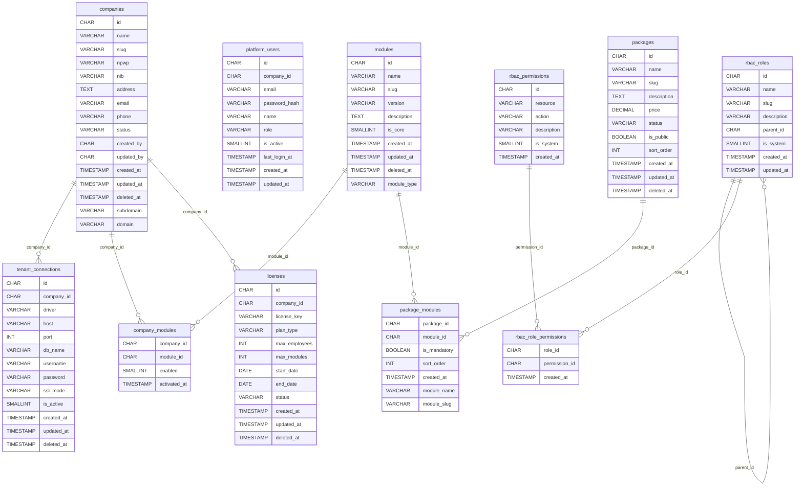


## Tenant Database

Satu database terisolasi **per company** (database per tenant). Struktur identik untuk semua tenant (dibuat saat provisioning company).

Total **199 tabel** dikelompokkan dalam 19 modul:

> ℹ️ **Catatan:** pengelompokan di sini berbasis **domain tabel** (mis. Performance dipecah jadi KPI & OKR, RBAC digabung dengan Auth) — bukan folder kode. Jumlah **folder modul tenant** di kode = **19** (termasuk `notification`, `rbac`, `useraccount`), lihat [`go-module-architecture-report.md`](go-module-architecture-report.md).

| # | Modul | Jumlah Tabel |
|---|---|---|
| 1 | Master Data & Settings | 20 |
| 2 | Organization | 6 |
| 3 | Employee | 10 |
| 4 | Attendance | 11 |
| 5 | Notification | 1 |
| 6 | Leave | 7 |
| 7 | Payroll | 21 |
| 8 | Competency | 7 |
| 9 | Job Management | 22 |
| 10 | Approval Engine | 6 |
| 11 | RBAC & Auth | 9 |
| 12 | Employee Movement | 2 |
| 13 | Reimbursement | 3 |
| 14 | Performance — KPI | 17 |
| 15 | Performance — OKR | 8 |
| 16 | Recruitment | 7 |
| 17 | Training | 7 |
| 18 | Workforce Intelligence | 7 |
| 19 | Career Intelligence | 4 |

---

## Master Data & Settings

| Tabel | Jumlah Kolom | FK Utama |
|---|---|---|
| `religions` | 9 | - |
| `educations` | 9 | - |
| `education_majors` | 7 | - |
| `marital_statuses` | 9 | - |
| `provinces` | 6 | - |
| `regencies` | 6 | province_id->provinces |
| `districts` | 6 | regency_id->regencies |
| `villages` | 6 | district_id->districts |
| `relationship_types` | 9 | - |
| `employment_statuses` | 12 | - |
| `gradings` | 8 | - |
| `job_families` | 8 | - |
| `banks` | 7 | - |
| `nationalities` | 7 | - |
| `salary_grades` | 10 | - |
| `ptkps` | 9 | - |
| `ters` | 10 | - |
| `insurances` | 7 | - |
| `company_holidays` | 6 | - |
| `document_templates` | 7 | - |

### ERD — Master Data & Settings

```mermaid
erDiagram
    religions {
        CHAR id
        VARCHAR code
        VARCHAR name
        INT sort_order
        CHAR created_by
        CHAR updated_by
        TIMESTAMP created_at
        TIMESTAMP updated_at
        TIMESTAMP deleted_at
    }
    educations {
        CHAR id
        VARCHAR code
        VARCHAR name
        INT sort_order
        CHAR created_by
        CHAR updated_by
        TIMESTAMP created_at
        TIMESTAMP updated_at
        TIMESTAMP deleted_at
    }
    education_majors {
        CHAR id
        VARCHAR code
        VARCHAR name
        INT sort_order
        TIMESTAMP created_at
        TIMESTAMP updated_at
        TIMESTAMP deleted_at
    }
    marital_statuses {
        CHAR id
        VARCHAR code
        VARCHAR name
        INT sort_order
        CHAR created_by
        CHAR updated_by
        TIMESTAMP created_at
        TIMESTAMP updated_at
        TIMESTAMP deleted_at
    }
    provinces {
        CHAR id
        VARCHAR code
        VARCHAR name
        TIMESTAMP created_at
        TIMESTAMP updated_at
        TIMESTAMP deleted_at
    }
    regencies {
        CHAR id
        VARCHAR code
        CHAR province_id
        VARCHAR name
        TIMESTAMP created_at
        TIMESTAMP updated_at
    }
    districts {
        CHAR id
        VARCHAR code
        CHAR regency_id
        VARCHAR name
        TIMESTAMP created_at
        TIMESTAMP updated_at
    }
    villages {
        CHAR id
        VARCHAR code
        CHAR district_id
        VARCHAR name
        TIMESTAMP created_at
        TIMESTAMP updated_at
    }
    relationship_types {
        CHAR id
        VARCHAR code
        VARCHAR name
        INT sort_order
        CHAR created_by
        CHAR updated_by
        TIMESTAMP created_at
        TIMESTAMP updated_at
        TIMESTAMP deleted_at
    }
    employment_statuses {
        CHAR id
        VARCHAR code
        VARCHAR name
        SMALLINT has_duration
        INT duration
        VARCHAR duration_type
        INT sort_order
        CHAR created_by
        CHAR updated_by
        TIMESTAMP created_at
        TIMESTAMP updated_at
        TIMESTAMP deleted_at
    }
    gradings {
        CHAR id
        VARCHAR code
        VARCHAR name
        TEXT description
        INT sort_order
        TIMESTAMP created_at
        TIMESTAMP updated_at
        TIMESTAMP deleted_at
    }
    job_families {
        CHAR id
        VARCHAR code
        VARCHAR name
        TEXT description
        INT sort_order
        TIMESTAMP created_at
        TIMESTAMP updated_at
        TIMESTAMP deleted_at
    }
    banks {
        CHAR id
        VARCHAR code
        VARCHAR name
        INT sort_order
        TIMESTAMP created_at
        TIMESTAMP updated_at
        TIMESTAMP deleted_at
    }
    nationalities {
        CHAR id
        VARCHAR code
        VARCHAR name
        INT sort_order
        TIMESTAMP created_at
        TIMESTAMP updated_at
        TIMESTAMP deleted_at
    }
    salary_grades {
        CHAR id
        VARCHAR code
        VARCHAR name
        TEXT description
        DECIMAL min_amount
        DECIMAL max_amount
        INT sort_order
        TIMESTAMP created_at
        TIMESTAMP updated_at
        TIMESTAMP deleted_at
    }
    ptkps {
        CHAR id
        VARCHAR name
        BIGINT ptkp
        CHAR group
        CHAR created_by
        CHAR updated_by
        TIMESTAMP created_at
        TIMESTAMP updated_at
        TIMESTAMP deleted_at
    }
    ters {
        CHAR id
        CHAR group
        BIGINT bruto_min
        BIGINT bruto_max
        DECIMAL rate
        CHAR created_by
        CHAR updated_by
        TIMESTAMP created_at
        TIMESTAMP updated_at
        TIMESTAMP deleted_at
    }
    insurances {
        CHAR id
        VARCHAR code
        VARCHAR name
        INT sort_order
        TIMESTAMP created_at
        TIMESTAMP updated_at
        TIMESTAMP deleted_at
    }
    company_holidays {
        CHAR id
        DATE holiday_date
        VARCHAR name
        TEXT description
        SMALLINT is_active
        TIMESTAMP created_at
    }
    document_templates {
        CHAR id
        VARCHAR name
        VARCHAR type
        TEXT content
        SMALLINT is_active
        TIMESTAMP created_at
        TIMESTAMP updated_at
    }
    provinces ||--o{ regencies : "province_id"
    regencies ||--o{ districts : "regency_id"
    districts ||--o{ villages : "district_id"
```


## Organization

| Tabel | Jumlah Kolom | FK Utama |
|---|---|---|
| `organization_summaries` | 10 | - |
| `organization_levels` | 5 | - |
| `zones` | 13 | - |
| `organizations` | 17 | organization_summary_id->organization_summaries, parent_id->organizations, zone_id->zones, job_family_id->job_families, grading_id->gradings |
| `positions` | 14 | organization_id->organizations, parent_position_id->positions, job_family_id->job_families, grading_id->gradings |
| `job_family_competencies` | 5 | job_family_id->job_families, competency_id->competencies |

### ERD — Organization

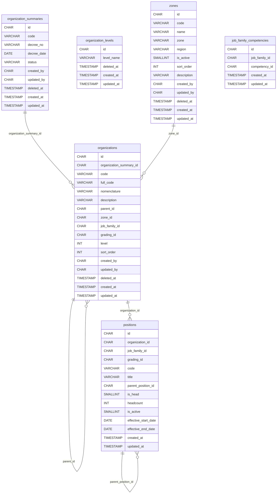


## Employee

| Tabel | Jumlah Kolom | FK Utama |
|---|---|---|
| `employees` | 24 | religion_id->religions, marital_status_id->marital_statuses, nationality_id->nationalities |
| `employments` | 13 | employee_id->employees, organization_id->organizations, position_id->positions, employment_status_id->employment_statuses |
| `employee_addresses` | 13 | employee_id->employees, province_id->provinces, regency_id->regencies, district_id->districts, village_id->villages |
| `emergency_contacts` | 10 | employee_id->employees, relationship_type_id->relationship_types |
| `employee_families` | 11 | employee_id->employees, relationship_type_id->relationship_types, education_id->educations |
| `employee_educations` | 11 | employee_id->employees, education_id->educations |
| `employee_experiences` | 10 | employee_id->employees |
| `employee_documents` | 9 | employee_id->employees |
| `employee_insurances` | 11 | employee_id->employees, insurance_id->insurances |
| `employee_bank_accounts` | 9 | employee_id->employees |

### ERD — Employee

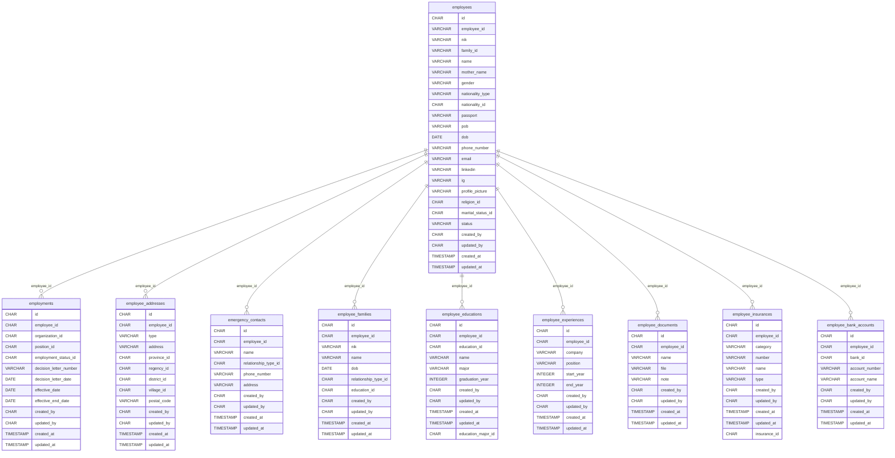


## Attendance

| Tabel | Jumlah Kolom | FK Utama |
|---|---|---|
| `attendance_company_settings` | 16 | - |
| `attendance_company_shifts` | 10 | - |
| `attendance_employee_shifts` | 12 | employee_id->employees, attendance_shift_id->attendance_company_shifts |
| `attendance_locations` | 10 | - |
| `attendance_device_captures` | 10 | - |
| `attendance_face_captures` | 11 | employee_id->employees |
| `attendance_events` | 20 | employee_id->employees, device_id->attendance_device_captures, face_capture_id->attendance_face_captures |
| `attendance_sessions` | 23 | employee_id->employees, shift_id->attendance_company_shifts, checkin_event_id->attendance_events, checkout_event_id->attendance_events |
| `attendance_overtime_requests` | 29 | employee_id->employees |
| `attendance_exempt_positions` | 9 | organization_id->organizations |
| `attendance_correction_requests` | 13 | employee_id->employees, attendance_session_id->attendance_sessions |

### ERD — Attendance

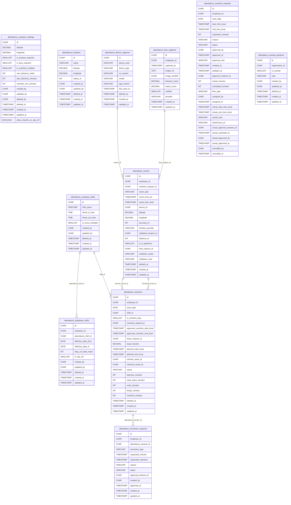


## Notification

| Tabel | Jumlah Kolom | FK Utama |
|---|---|---|
| `notifications` | 11 | - |

### ERD — Notification

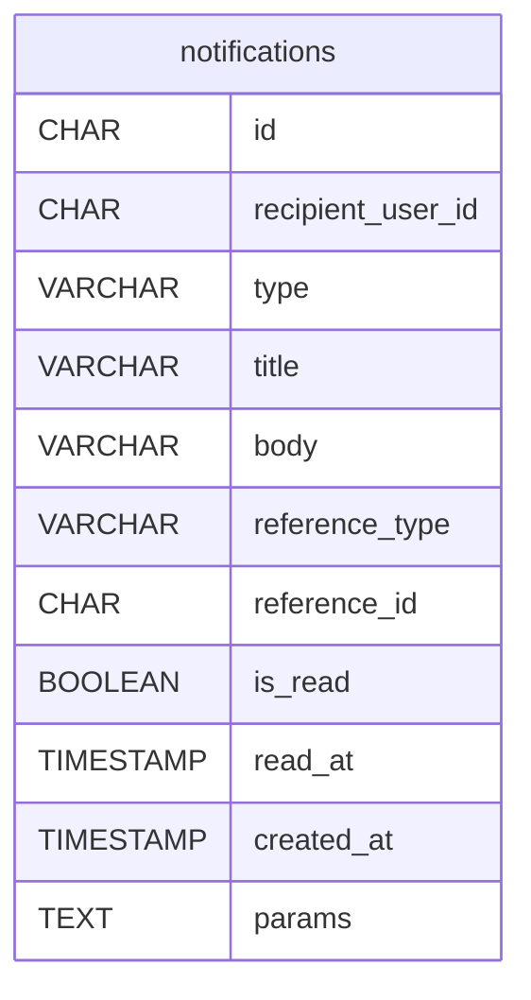


## Leave

| Tabel | Jumlah Kolom | FK Utama |
|---|---|---|
| `leave_types` | 15 | - |
| `leave_accrual_policies` | 11 | leave_type_id->leave_types |
| `leave_reasons` | 7 | - |
| `leave_requests` | 27 | employee_id->employees, leave_type_id->leave_types, leave_reason_id->leave_reasons |
| `leave_request_details` | 10 | leave_request_id->leave_requests, employee_id->employees |
| `employee_leave_balances` | 12 | employee_id->employees, leave_type_id->leave_types |
| `leave_balance_transactions` | 13 | employee_id->employees, leave_type_id->leave_types, balance_id->employee_leave_balances |

### ERD — Leave

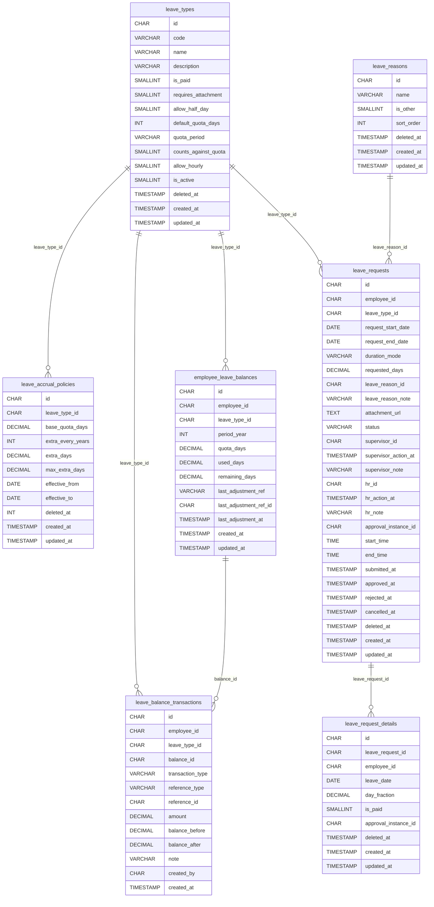


## Payroll

| Tabel | Jumlah Kolom | FK Utama |
|---|---|---|
| `salary_components` | 17 | - |
| `salary_grade_components` | 15 | grading_id->gradings, salary_component_id->salary_components |
| `salary_employee_components` | 18 | employee_id->employees, employment_id->employments, position_id->positions, grading_id->gradings, salary_component_id->salary_components |
| `salary_change_logs` | 19 | employee_id->employees |
| `salary_employee_adjustments` | 19 | employee_id->employees, employment_id->employments, position_id->positions, salary_component_id->salary_components |
| `payroll_periods` | 12 | - |
| `employee_payroll_profiles` | 16 | employee_id->employees, employment_id->employments |
| `employee_bank_profiles` | 17 | employee_id->employees, employee_payroll_profile_id->employee_payroll_profiles |
| `employee_bpjs_profiles` | 19 | employee_id->employees, employee_payroll_profile_id->employee_payroll_profiles |
| `employee_tax_profiles` | 17 | employee_id->employees, employee_payroll_profile_id->employee_payroll_profiles |
| `bpjs_settings` | 16 | - |
| `bpjs_rate_components` | 25 | bpjs_setting_id->bpjs_settings, salary_component_id->salary_components |
| `pph21_settings` | 24 | pph21_component_id->salary_components |
| `pph21_ptkp_rates` | 11 | - |
| `pph21_tax_brackets` | 12 | - |
| `payroll_runs` | 20 | payroll_period_id->payroll_periods |
| `payroll_run_employees` | 18 | payroll_run_id->payroll_runs, employee_id->employees, employment_id->employments, position_id->positions |
| `payroll_run_items` | 23 | payroll_run_id->payroll_runs, payroll_run_employee_id->payroll_run_employees, salary_component_id->salary_components |
| `payroll_payslips` | 23 | payroll_run_id->payroll_runs, payroll_run_employee_id->payroll_run_employees, employee_id->employees |
| `pph21_calculation_logs` | 28 | payroll_run_id->payroll_runs, payroll_run_employee_id->payroll_run_employees, employee_id->employees, pph21_setting_id->pph21_settings, employee_tax_profile_id->employee_tax_profiles |
| `payroll_profile_change_logs` | 13 | employee_id->employees |

### ERD — Payroll

```mermaid
erDiagram
    salary_components {
        CHAR id
        VARCHAR code
        VARCHAR name
        TEXT description
        VARCHAR component_type
        VARCHAR calculation_type
        SMALLINT is_taxable
        SMALLINT is_bpjs_base
        SMALLINT is_recurring
        SMALLINT is_proratable
        SMALLINT print_on_salary_structure
        INT display_order
        VARCHAR status
        CHAR created_by
        CHAR updated_by
        TIMESTAMP created_at
        TIMESTAMP updated_at
    }
    salary_grade_components {
        CHAR id
        CHAR grading_id
        CHAR salary_component_id
        DECIMAL amount
        CHAR currency_code
        DATE effective_start_date
        DATE effective_end_date
        SMALLINT is_mandatory
        SMALLINT is_default
        VARCHAR status
        TEXT notes
        CHAR created_by
        CHAR updated_by
        TIMESTAMP created_at
        TIMESTAMP updated_at
    }
    salary_employee_components {
        CHAR id
        CHAR employee_id
        CHAR employment_id
        CHAR position_id
        CHAR grading_id
        CHAR salary_component_id
        DECIMAL amount
        CHAR currency_code
        VARCHAR source_type
        CHAR source_ref_id
        DATE effective_start_date
        DATE effective_end_date
        TEXT notes
        VARCHAR status
        CHAR created_by
        CHAR updated_by
        TIMESTAMP created_at
        TIMESTAMP updated_at
    }
    salary_change_logs {
        CHAR id
        CHAR employee_id
        CHAR employee_salary_component_id
        CHAR salary_component_id
        VARCHAR action_type
        DECIMAL old_amount
        DECIMAL new_amount
        DATE old_effective_start_date
        DATE new_effective_start_date
        DATE old_effective_end_date
        DATE new_effective_end_date
        VARCHAR reason
        TEXT notes
        JSON before_json
        JSON after_json
        CHAR changed_by
        TIMESTAMP changed_at
        TIMESTAMP created_at
        TIMESTAMP updated_at
    }
    salary_employee_adjustments {
        CHAR id
        CHAR employee_id
        CHAR employment_id
        CHAR position_id
        CHAR salary_component_id
        INT period_year
        SMALLINT period_month
        DECIMAL amount
        CHAR currency_code
        VARCHAR source_type
        VARCHAR reason
        TEXT notes
        VARCHAR status
        CHAR approved_by
        TIMESTAMP approved_at
        CHAR created_by
        CHAR updated_by
        TIMESTAMP created_at
        TIMESTAMP updated_at
    }
    payroll_periods {
        CHAR id
        VARCHAR period_code
        INT period_year
        SMALLINT period_month
        DATE start_date
        DATE end_date
        DATE as_of_date
        VARCHAR status
        CHAR created_by
        CHAR updated_by
        TIMESTAMP created_at
        TIMESTAMP updated_at
    }
    employee_payroll_profiles {
        CHAR id
        CHAR employee_id
        CHAR employment_id
        VARCHAR payroll_group_code
        VARCHAR payroll_frequency
        VARCHAR payment_method
        CHAR salary_currency
        SMALLINT is_payroll_active
        DATE effective_start_date
        DATE effective_end_date
        VARCHAR status
        TEXT notes
        CHAR created_by
        CHAR updated_by
        TIMESTAMP created_at
        TIMESTAMP updated_at
    }
    employee_bank_profiles {
        CHAR id
        CHAR employee_id
        CHAR employee_payroll_profile_id
        VARCHAR bank_code
        VARCHAR bank_name
        VARCHAR bank_branch
        VARCHAR bank_account_number
        VARCHAR bank_account_holder_name
        SMALLINT is_primary
        DATE effective_start_date
        DATE effective_end_date
        VARCHAR status
        TEXT notes
        CHAR created_by
        CHAR updated_by
        TIMESTAMP created_at
        TIMESTAMP updated_at
    }
    employee_bpjs_profiles {
        CHAR id
        CHAR employee_id
        CHAR employee_payroll_profile_id
        SMALLINT bpjs_health_active
        VARCHAR bpjs_health_no
        VARCHAR bpjs_health_registered_name
        SMALLINT bpjs_tk_active
        VARCHAR bpjs_tk_no
        VARCHAR bpjs_tk_registered_name
        VARCHAR jkk_risk_class
        SMALLINT pension_active
        DATE effective_start_date
        DATE effective_end_date
        VARCHAR status
        TEXT notes
        CHAR created_by
        CHAR updated_by
        TIMESTAMP created_at
        TIMESTAMP updated_at
    }
    employee_tax_profiles {
        CHAR id
        CHAR employee_id
        CHAR employee_payroll_profile_id
        VARCHAR npwp
        VARCHAR npwp_registered_name
        VARCHAR ptkp_status
        VARCHAR tax_method
        SMALLINT is_taxable
        SMALLINT has_npwp
        DATE effective_start_date
        DATE effective_end_date
        VARCHAR status
        TEXT notes
        CHAR created_by
        CHAR updated_by
        TIMESTAMP created_at
        TIMESTAMP updated_at
    }
    bpjs_settings {
        CHAR id
        VARCHAR setting_code
        VARCHAR setting_name
        VARCHAR base_source
        DECIMAL health_max_base_amount
        DECIMAL pension_max_base_amount
        VARCHAR default_jkk_risk_class
        VARCHAR rounding_mode
        DATE effective_start_date
        DATE effective_end_date
        VARCHAR status
        TEXT notes
        CHAR created_by
        CHAR updated_by
        TIMESTAMP created_at
        TIMESTAMP updated_at
    }
    bpjs_rate_components {
        CHAR id
        CHAR bpjs_setting_id
        VARCHAR rate_code
        VARCHAR rate_name
        VARCHAR bpjs_program
        VARCHAR paid_by
        CHAR salary_component_id
        DECIMAL rate_percent
        DECIMAL fixed_amount
        DECIMAL min_base_amount
        DECIMAL max_base_amount
        VARCHAR jkk_risk_class
        SMALLINT is_employee_deduction
        SMALLINT is_employer_contribution
        SMALLINT generate_to_payroll_item
        SMALLINT print_on_payslip
        INT display_order
        DATE effective_start_date
        DATE effective_end_date
        VARCHAR status
        TEXT notes
        CHAR created_by
        CHAR updated_by
        TIMESTAMP created_at
        TIMESTAMP updated_at
    }
    pph21_settings {
        CHAR id
        VARCHAR setting_code
        VARCHAR setting_name
        VARCHAR calculation_method
        VARCHAR default_tax_method
        CHAR pph21_component_id
        DECIMAL occupational_expense_rate_percent
        DECIMAL occupational_expense_max_monthly
        DECIMAL occupational_expense_max_yearly
        SMALLINT deduct_bpjs_health_employee
        SMALLINT deduct_bpjs_jht_employee
        SMALLINT deduct_bpjs_jp_employee
        SMALLINT annualization_months
        DECIMAL pkp_rounding_unit
        DECIMAL non_npwp_multiplier_percent
        VARCHAR rounding_mode
        DATE effective_start_date
        DATE effective_end_date
        VARCHAR status
        TEXT notes
        CHAR created_by
        CHAR updated_by
        TIMESTAMP created_at
        TIMESTAMP updated_at
    }
    pph21_ptkp_rates {
        CHAR id
        VARCHAR ptkp_status
        VARCHAR description
        DECIMAL annual_amount
        DATE effective_start_date
        DATE effective_end_date
        VARCHAR status
        CHAR created_by
        CHAR updated_by
        TIMESTAMP created_at
        TIMESTAMP updated_at
    }
    pph21_tax_brackets {
        CHAR id
        INT bracket_order
        DECIMAL lower_bound
        DECIMAL upper_bound
        DECIMAL rate_percent
        DATE effective_start_date
        DATE effective_end_date
        VARCHAR status
        CHAR created_by
        CHAR updated_by
        TIMESTAMP created_at
        TIMESTAMP updated_at
    }
    payroll_runs {
        CHAR id
        CHAR payroll_period_id
        VARCHAR run_code
        VARCHAR run_type
        VARCHAR status
        INT total_employees
        DECIMAL total_earning
        DECIMAL total_deduction
        DECIMAL total_employer_contribution
        DECIMAL total_net
        DECIMAL total_company_cost
        TIMESTAMP calculated_at
        TIMESTAMP reviewed_at
        TIMESTAMP approved_at
        TIMESTAMP locked_at
        CHAR created_by
        CHAR updated_by
        TIMESTAMP created_at
        TIMESTAMP updated_at
        CHAR approval_instance_id
    }
    payroll_run_employees {
        CHAR id
        CHAR payroll_run_id
        CHAR employee_id
        CHAR employment_id
        CHAR position_id
        CHAR grading_id
        VARCHAR employee_code
        VARCHAR employee_name
        VARCHAR position_title
        VARCHAR grading_name
        DECIMAL total_earning
        DECIMAL total_deduction
        DECIMAL total_employer_contribution
        DECIMAL net_amount
        DECIMAL total_company_cost
        VARCHAR status
        TIMESTAMP created_at
        TIMESTAMP updated_at
    }
    payroll_run_items {
        CHAR id
        CHAR payroll_run_id
        CHAR payroll_run_employee_id
        CHAR employee_id
        CHAR salary_component_id
        VARCHAR component_code
        VARCHAR component_name
        VARCHAR component_type
        VARCHAR item_category
        VARCHAR paid_by
        SMALLINT affects_gross_pay
        SMALLINT affects_net_pay
        SMALLINT affects_company_cost
        SMALLINT print_on_payslip
        DECIMAL amount
        CHAR currency_code
        VARCHAR source_group
        VARCHAR source_table
        CHAR source_id
        VARCHAR source_type
        TEXT notes
        TIMESTAMP created_at
        TIMESTAMP updated_at
    }
    payroll_payslips {
        CHAR id
        CHAR payroll_run_id
        CHAR payroll_run_employee_id
        CHAR employee_id
        VARCHAR payslip_number
        INT period_year
        SMALLINT period_month
        VARCHAR period_code
        VARCHAR employee_code
        VARCHAR employee_name
        VARCHAR position_title
        VARCHAR grading_name
        DECIMAL total_earning
        DECIMAL total_deduction
        DECIMAL net_amount
        VARCHAR status
        TIMESTAMP generated_at
        TIMESTAMP published_at
        TIMESTAMP cancelled_at
        CHAR created_by
        CHAR updated_by
        TIMESTAMP created_at
        TIMESTAMP updated_at
    }
    pph21_calculation_logs {
        CHAR id
        CHAR payroll_run_id
        CHAR payroll_run_employee_id
        CHAR employee_id
        CHAR pph21_setting_id
        CHAR employee_tax_profile_id
        CHAR payroll_run_item_id
        VARCHAR tax_method
        VARCHAR ptkp_status
        SMALLINT has_npwp
        DECIMAL gross_monthly
        DECIMAL occupational_expense_monthly
        DECIMAL bpjs_tax_deductible_monthly
        DECIMAL net_monthly
        DECIMAL net_annualized
        DECIMAL ptkp_annual
        DECIMAL pkp_annual
        DECIMAL annual_tax_before_npwp_mult
        DECIMAL non_npwp_multiplier_percent
        DECIMAL annual_tax_after_npwp_mult
        DECIMAL pph21_monthly
        JSON formula_json
        VARCHAR status
        TEXT notes
        CHAR created_by
        CHAR updated_by
        TIMESTAMP created_at
        TIMESTAMP updated_at
    }
    payroll_profile_change_logs {
        CHAR id
        CHAR employee_id
        VARCHAR profile_table
        CHAR profile_record_id
        VARCHAR action_type
        VARCHAR reason
        TEXT notes
        JSON before_json
        JSON after_json
        CHAR changed_by
        TIMESTAMP changed_at
        TIMESTAMP created_at
        TIMESTAMP updated_at
    }
    salary_components ||--o{ salary_grade_components : "salary_component_id"
    salary_components ||--o{ salary_employee_components : "salary_component_id"
    salary_components ||--o{ salary_employee_adjustments : "salary_component_id"
    employee_payroll_profiles ||--o{ employee_bank_profiles : "employee_payroll_profile_id"
    employee_payroll_profiles ||--o{ employee_bpjs_profiles : "employee_payroll_profile_id"
    employee_payroll_profiles ||--o{ employee_tax_profiles : "employee_payroll_profile_id"
    bpjs_settings ||--o{ bpjs_rate_components : "bpjs_setting_id"
    salary_components ||--o{ bpjs_rate_components : "salary_component_id"
    salary_components ||--o{ pph21_settings : "pph21_component_id"
    payroll_periods ||--o{ payroll_runs : "payroll_period_id"
    payroll_runs ||--o{ payroll_run_employees : "payroll_run_id"
    payroll_runs ||--o{ payroll_run_items : "payroll_run_id"
    payroll_run_employees ||--o{ payroll_run_items : "payroll_run_employee_id"
    salary_components ||--o{ payroll_run_items : "salary_component_id"
    payroll_runs ||--o{ payroll_payslips : "payroll_run_id"
    payroll_run_employees ||--o{ payroll_payslips : "payroll_run_employee_id"
    payroll_runs ||--o{ pph21_calculation_logs : "payroll_run_id"
    payroll_run_employees ||--o{ pph21_calculation_logs : "payroll_run_employee_id"
    pph21_settings ||--o{ pph21_calculation_logs : "pph21_setting_id"
    employee_tax_profiles ||--o{ pph21_calculation_logs : "employee_tax_profile_id"
```


## Competency

| Tabel | Jumlah Kolom | FK Utama |
|---|---|---|
| `competencies` | 9 | - |
| `competence_values` | 8 | - |
| `competency_values` | 9 | - |
| `competency_events` | 10 | - |
| `competency_event_targets` | 10 | competency_event_id->competency_events, organization_id->organizations, employee_id->employees |
| `competency_scores` | 11 | organization_id->organizations, employee_id->employees, competency_event_id->competency_events |
| `competency_score_details` | 11 | competency_score_id->competency_scores, competency_id->competencies |

### ERD — Competency

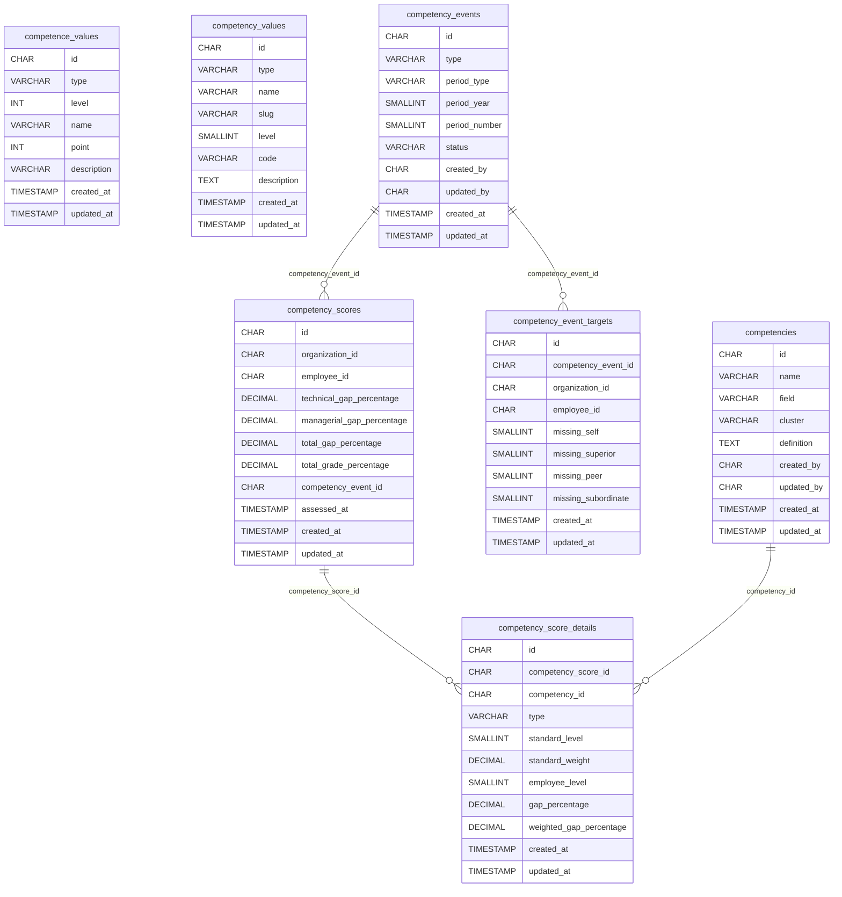


## Job Management

| Tabel | Jumlah Kolom | FK Utama |
|---|---|---|
| `job_management_titles` | 8 | - |
| `job_management_title_subs` | 10 | - |
| `job_management_values` | 16 | - |
| `job_management_objectives` | 9 | organization_id->organizations |
| `job_management_identifications` | 9 | organization_id->organizations, grading_id->gradings |
| `job_management_responsibilities` | 12 | organization_id->organizations |
| `job_management_education_experiences` | 15 | organization_id->organizations, education_id->educations, education_major_id->education_majors, job_family_id->job_families, education_id->job_management_values, experience_id->job_management_values |
| `job_management_hr_authorities` | 9 | organization_id->organizations |
| `job_management_operational_authorities` | 9 | organization_id->organizations |
| `job_management_working_activities` | 9 | organization_id->organizations |
| `job_management_working_risks` | 10 | organization_id->organizations |
| `job_management_relationships` | 10 | organization_id->organizations |
| `job_management_subordinate_controls` | 9 | organization_id->organizations |
| `job_management_assets` | 10 | organization_id->organizations |
| `job_management_financials` | 12 | organization_id->organizations |
| `job_management_potency_competencies` | 9 | organization_id->organizations, competency_id->competencies |
| `job_management_scores` | 12 | organization_id->organizations |
| `job_management_competency_groups` | 6 | organization_id->organizations |
| `job_management_value_clusters` | 5 | - |
| `job_management_majors` | 5 | job_management_education_experience_id->job_management_education_experiences, education_major_id->education_majors |
| `job_management_job_family` | 5 | job_management_education_experience_id->job_management_education_experiences, job_family_id->job_families |
| `job_management_relationship_details` | 8 | job_management_relationship_id->job_management_relationships, organization_id->organizations |

### ERD — Job Management

```mermaid
erDiagram
    job_management_titles {
        CHAR id
        VARCHAR name
        TEXT descriptions
        SMALLINT status
        CHAR created_by
        CHAR updated_by
        TIMESTAMP created_at
        TIMESTAMP updated_at
    }
    job_management_title_subs {
        CHAR id
        CHAR job_management_title_id
        VARCHAR job_management_title_name
        VARCHAR name
        TEXT descriptions
        SMALLINT status
        CHAR created_by
        CHAR updated_by
        TIMESTAMP created_at
        TIMESTAMP updated_at
    }
    job_management_values {
        CHAR id
        CHAR job_management_title_sub_id
        VARCHAR job_management_title_sub_name
        VARCHAR type
        INT level
        TEXT descriptions
        TEXT note
        INT sort
        CHAR ref_id
        VARCHAR ref_type
        CHAR created_by
        CHAR updated_by
        TIMESTAMP created_at
        TIMESTAMP updated_at
        VARCHAR type_group
        TEXT description_group
    }
    job_management_objectives {
        CHAR id
        CHAR organization_id
        VARCHAR nomenclature
        VARCHAR full_code
        TEXT objective
        CHAR created_by
        CHAR updated_by
        TIMESTAMP created_at
        TIMESTAMP updated_at
    }
    job_management_identifications {
        CHAR id
        CHAR organization_id
        VARCHAR nomenclature
        VARCHAR full_code
        CHAR grading_id
        CHAR created_by
        CHAR updated_by
        TIMESTAMP created_at
        TIMESTAMP updated_at
    }
    job_management_responsibilities {
        CHAR id
        CHAR organization_id
        VARCHAR nomenclature
        VARCHAR full_code
        TEXT main_task
        TEXT activities
        TEXT outputs
        TEXT success_indicators
        CHAR created_by
        CHAR updated_by
        TIMESTAMP created_at
        TIMESTAMP updated_at
    }
    job_management_education_experiences {
        CHAR id
        CHAR organization_id
        VARCHAR nomenclature
        VARCHAR full_code
        CHAR job_management_value_education_id
        CHAR job_management_value_experience_id
        CHAR created_by
        CHAR updated_by
        TIMESTAMP created_at
        TIMESTAMP updated_at
        CHAR education_id
        CHAR education_major_id
        CHAR job_family_id
        VARCHAR experience_range
        CHAR experience_id
    }
    job_management_hr_authorities {
        CHAR id
        CHAR organization_id
        VARCHAR nomenclature
        VARCHAR full_code
        TEXT description
        CHAR created_by
        CHAR updated_by
        TIMESTAMP created_at
        TIMESTAMP updated_at
    }
    job_management_operational_authorities {
        CHAR id
        CHAR organization_id
        VARCHAR nomenclature
        VARCHAR full_code
        TEXT description
        CHAR created_by
        CHAR updated_by
        TIMESTAMP created_at
        TIMESTAMP updated_at
    }
    job_management_working_activities {
        CHAR id
        CHAR organization_id
        VARCHAR nomenclature
        VARCHAR full_code
        CHAR job_management_value_id
        CHAR created_by
        CHAR updated_by
        TIMESTAMP created_at
        TIMESTAMP updated_at
    }
    job_management_working_risks {
        CHAR id
        CHAR organization_id
        VARCHAR nomenclature
        VARCHAR full_code
        CHAR job_management_value_environment_id
        CHAR job_management_value_hazard_id
        CHAR created_by
        CHAR updated_by
        TIMESTAMP created_at
        TIMESTAMP updated_at
    }
    job_management_relationships {
        CHAR id
        CHAR organization_id
        VARCHAR nomenclature
        VARCHAR full_code
        CHAR job_management_value_relationship_id
        CHAR job_management_value_frequency_id
        CHAR created_by
        CHAR updated_by
        TIMESTAMP created_at
        TIMESTAMP updated_at
    }
    job_management_subordinate_controls {
        CHAR id
        CHAR organization_id
        VARCHAR nomenclature
        VARCHAR full_code
        CHAR job_management_value_id
        CHAR created_by
        CHAR updated_by
        TIMESTAMP created_at
        TIMESTAMP updated_at
    }
    job_management_assets {
        CHAR id
        CHAR organization_id
        VARCHAR nomenclature
        VARCHAR full_code
        CHAR job_management_value_asset_id
        CHAR job_management_value_authority_id
        CHAR created_by
        CHAR updated_by
        TIMESTAMP created_at
        TIMESTAMP updated_at
    }
    job_management_financials {
        CHAR id
        CHAR organization_id
        VARCHAR nomenclature
        VARCHAR full_code
        SMALLINT is_authorized
        CHAR job_management_value_cash_id
        CHAR job_management_value_authority_id
        CHAR job_management_value_impact_id
        CHAR created_by
        CHAR updated_by
        TIMESTAMP created_at
        TIMESTAMP updated_at
    }
    job_management_potency_competencies {
        CHAR id
        CHAR organization_id
        CHAR job_management_value_id
        CHAR competency_id
        DECIMAL weight
        CHAR created_by
        CHAR updated_by
        TIMESTAMP created_at
        TIMESTAMP updated_at
    }
    job_management_scores {
        CHAR id
        CHAR organization_id
        BIGINT job_value_with_financial
        BIGINT job_value_without_financial
        SMALLINT has_financial_authority
        JSON components
        JSON sub_component_points
        TIMESTAMP calculated_at
        TIMESTAMP created_at
        TIMESTAMP updated_at
        SMALLINT is_complete
        TIMESTAMP completed_at
    }
    job_management_competency_groups {
        CHAR id
        CHAR organization_id
        VARCHAR category
        DECIMAL weight
        TIMESTAMP created_at
        TIMESTAMP updated_at
    }
    job_management_value_clusters {
        UUID id
        VARCHAR type
        VARCHAR cluster
        TIMESTAMP created_at
        TIMESTAMP updated_at
    }
    job_management_majors {
        CHAR id
        CHAR job_management_education_experience_id
        CHAR education_major_id
        TIMESTAMP created_at
        TIMESTAMP updated_at
    }
    job_management_job_family {
        CHAR id
        CHAR job_management_education_experience_id
        CHAR job_family_id
        TIMESTAMP created_at
        TIMESTAMP updated_at
    }
    job_management_relationship_details {
        CHAR id
        CHAR job_management_relationship_id
        CHAR organization_id
        TEXT activity
        CHAR created_by
        CHAR updated_by
        TIMESTAMP created_at
        TIMESTAMP updated_at
    }
    job_management_values ||--o{ job_management_education_experiences : "education_id"
    job_management_values ||--o{ job_management_education_experiences : "experience_id"
    job_management_education_experiences ||--o{ job_management_majors : "job_management_education_experience_id"
    job_management_education_experiences ||--o{ job_management_job_family : "job_management_education_experience_id"
    job_management_relationships ||--o{ job_management_relationship_details : "job_management_relationship_id"
```


## Approval Engine

| Tabel | Jumlah Kolom | FK Utama |
|---|---|---|
| `approval_flows` | 8 | - |
| `approval_flow_steps` | 17 | flow_id->approval_flows |
| `approval_instances` | 10 | flow_id->approval_flows |
| `approval_actions` | 7 | instance_id->approval_instances |
| `approval_tasks` | 9 | instance_id->approval_instances |
| `approval_flow_step_organizations` | 4 | step_id->approval_flow_steps |

### ERD — Approval Engine

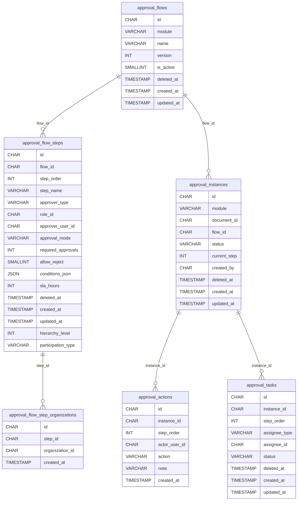


## RBAC & Auth

| Tabel | Jumlah Kolom | FK Utama |
|---|---|---|
| `features` | 7 | - |
| `permissions` | 5 | - |
| `roles` | 8 | - |
| `feature_permission` | 5 | feature_id->features, permission_id->permissions |
| `model_has_roles` | 3 | role_id->roles |
| `model_has_permissions` | 3 | permission_id->permissions |
| `role_has_permissions` | 2 | permission_id->permissions, role_id->roles |
| `users` | 9 | - |
| `employee_accounts` | 11 | - |

### ERD — RBAC & Auth

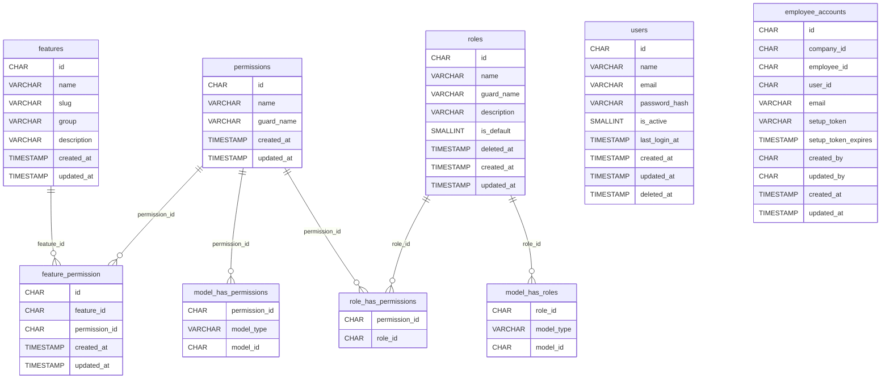


## Employee Movement

| Tabel | Jumlah Kolom | FK Utama |
|---|---|---|
| `employee_movements` | 33 | employee_id->employees, from_employment_id->employments, to_employment_id->employments, from_organization_id->organizations, to_organization_id->organizations, from_position_id->positions, to_position_id->positions, from_employment_status_id->employment_statuses, to_employment_status_id->employment_statuses |
| `employee_contracts` | 16 | employee_id->employees, previous_contract_id->employee_contracts |

### ERD — Employee Movement

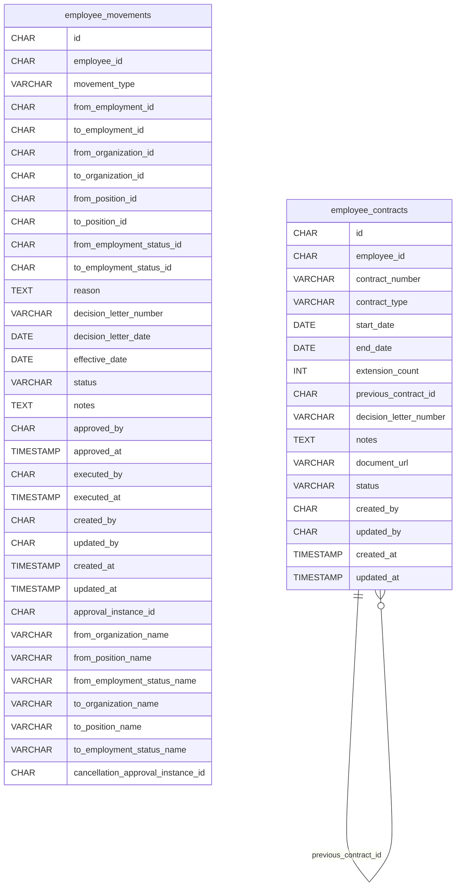


## Reimbursement

| Tabel | Jumlah Kolom | FK Utama |
|---|---|---|
| `reimbursement_types` | 8 | - |
| `reimbursement_requests` | 24 | - |
| `reimbursement_items` | 10 | - |

### ERD — Reimbursement

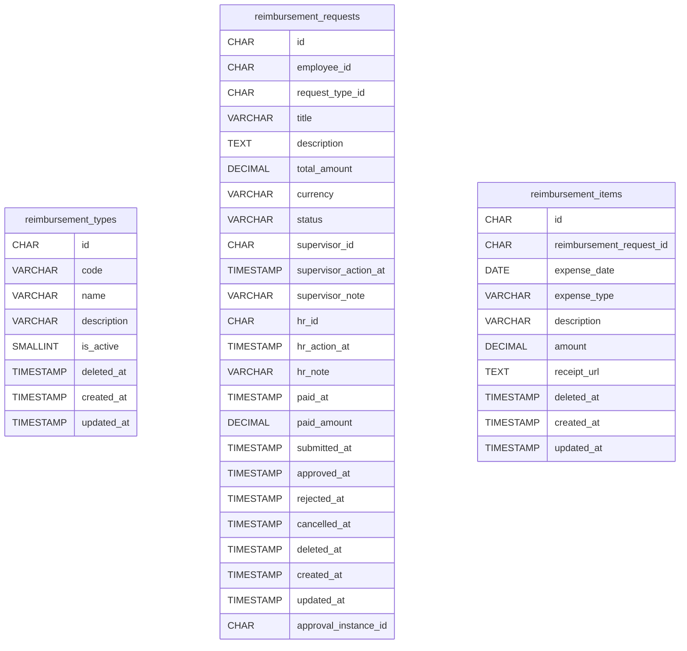


## Performance — KPI

| Tabel | Jumlah Kolom | FK Utama |
|---|---|---|
| `performance_periods` | 9 | - |
| `performance_perspectives` | 6 | - |
| `performance_templates` | 12 | period_id->performance_periods |
| `performance_indicators` | 18 | - |
| `performance_evaluations` | 22 | rating_id->performance_ratings |
| `performance_evaluation_details` | 16 | indicator_id->performance_indicators |
| `performance_components` | 9 | - |
| `performance_organization_components` | 8 | component_id->performance_components |
| `performance_evaluation_components` | 10 | evaluation_id->performance_evaluations, component_id->performance_components |
| `performance_evaluation_program_items` | 13 | performance_evaluation_id->performance_evaluations |
| `performance_targets` | 11 | - |
| `performance_ratings` | 10 | - |
| `performance_indicator_formulas` | 9 | - |
| `performance_progress` | 9 | evaluation_detail_id->performance_evaluation_details |
| `performance_comments` | 7 | evaluation_id->performance_evaluations |
| `performance_attachments` | 10 | evaluation_detail_id->performance_evaluation_details |
| `performance_logs` | 9 | evaluation_id->performance_evaluations |

### ERD — Performance — KPI

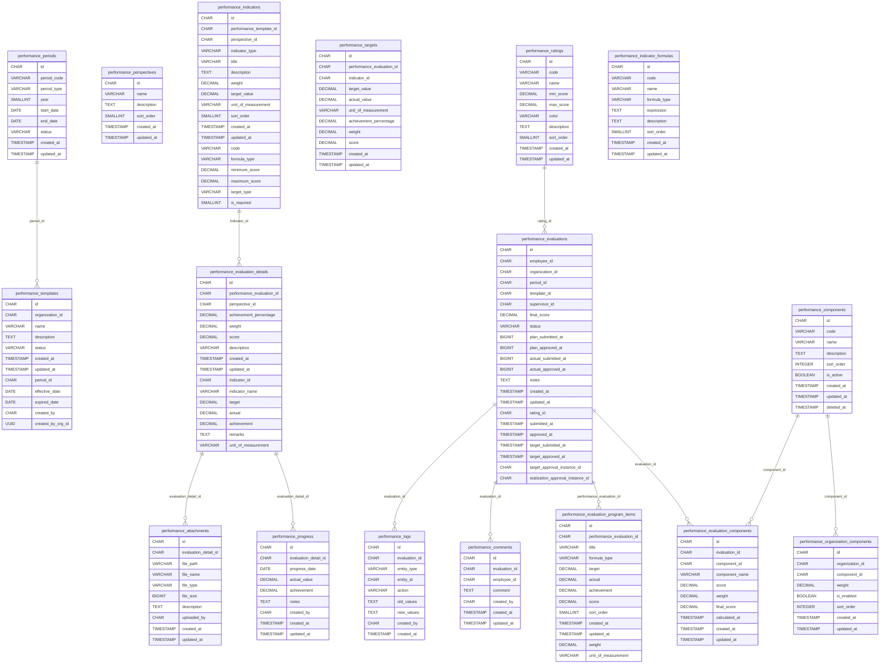


## Performance — OKR

| Tabel | Jumlah Kolom | FK Utama |
|---|---|---|
| `okr_templates` | 13 | organization_id->organizations, period_id->performance_periods |
| `okr_objectives` | 10 | template_id->okr_templates |
| `okr_key_results` | 17 | objective_id->okr_objectives |
| `okr_evaluations` | 19 | employee_id->employees, organization_id->organizations, period_id->performance_periods, template_id->okr_templates, rating_id->performance_ratings |
| `okr_evaluation_details` | 19 | evaluation_id->okr_evaluations, objective_id->okr_objectives, key_result_id->okr_key_results |
| `okr_progress` | 9 | evaluation_detail_id->okr_evaluation_details |
| `okr_comments` | 7 | evaluation_id->okr_evaluations, parent_id->okr_comments |
| `okr_attachments` | 10 | evaluation_detail_id->okr_evaluation_details |

### ERD — Performance — OKR

```mermaid
erDiagram
    okr_templates {
        CHAR id
        CHAR organization_id
        CHAR period_id
        VARCHAR name
        TEXT description
        SMALLINT status
        DATE effective_date
        DATE expired_date
        TIMESTAMP created_at
        TIMESTAMP updated_at
        TIMESTAMP deleted_at
        CHAR created_by
        UUID created_by_org_id
    }
    okr_objectives {
        CHAR id
        CHAR template_id
        VARCHAR code
        VARCHAR title
        TEXT description
        DECIMAL weight
        INT sort_order
        TIMESTAMP created_at
        TIMESTAMP updated_at
        TIMESTAMP deleted_at
    }
    okr_key_results {
        CHAR id
        CHAR objective_id
        VARCHAR code
        VARCHAR title
        TEXT description
        VARCHAR target_type
        DECIMAL target_value
        VARCHAR unit
        VARCHAR formula_type
        DECIMAL weight
        DECIMAL minimum_score
        DECIMAL maximum_score
        INT sort_order
        BOOLEAN is_required
        TIMESTAMP created_at
        TIMESTAMP updated_at
        TIMESTAMP deleted_at
    }
    okr_evaluations {
        CHAR id
        CHAR employee_id
        CHAR organization_id
        CHAR period_id
        CHAR template_id
        VARCHAR status
        TIMESTAMP submitted_at
        CHAR submitted_by
        TIMESTAMP approved_at
        CHAR approved_by
        DECIMAL final_score
        CHAR rating_id
        TEXT reviewer_notes
        TIMESTAMP created_at
        TIMESTAMP updated_at
        TIMESTAMP deleted_at
        CHAR kr_approval_instance_id
        CHAR assessment_approval_instance_id
        TIMESTAMP kr_submitted_at
    }
    okr_evaluation_details {
        CHAR id
        CHAR evaluation_id
        CHAR objective_id
        CHAR key_result_id
        VARCHAR objective_title
        VARCHAR key_result_title
        DECIMAL objective_weight
        DECIMAL key_result_weight
        DECIMAL target_value
        VARCHAR target_type
        VARCHAR unit
        VARCHAR formula_type
        DECIMAL actual_value
        DECIMAL achievement
        DECIMAL score
        TEXT remarks
        INT sort_order
        TIMESTAMP created_at
        TIMESTAMP updated_at
    }
    okr_progress {
        CHAR id
        CHAR evaluation_detail_id
        DATE progress_date
        DECIMAL actual_value
        DECIMAL achievement
        TEXT notes
        CHAR created_by
        TIMESTAMP created_at
        TIMESTAMP updated_at
    }
    okr_comments {
        CHAR id
        CHAR evaluation_id
        CHAR parent_id
        TEXT comment
        CHAR created_by
        TIMESTAMP created_at
        TIMESTAMP updated_at
    }
    okr_attachments {
        CHAR id
        CHAR evaluation_detail_id
        VARCHAR file_path
        VARCHAR file_name
        VARCHAR file_type
        BIGINT file_size
        TEXT description
        CHAR uploaded_by
        TIMESTAMP created_at
        TIMESTAMP updated_at
    }
    okr_templates ||--o{ okr_objectives : "template_id"
    okr_objectives ||--o{ okr_key_results : "objective_id"
    okr_templates ||--o{ okr_evaluations : "template_id"
    okr_evaluations ||--o{ okr_evaluation_details : "evaluation_id"
    okr_objectives ||--o{ okr_evaluation_details : "objective_id"
    okr_key_results ||--o{ okr_evaluation_details : "key_result_id"
    okr_evaluation_details ||--o{ okr_progress : "evaluation_detail_id"
    okr_evaluations ||--o{ okr_comments : "evaluation_id"
    okr_comments ||--o{ okr_comments : "parent_id"
    okr_evaluation_details ||--o{ okr_attachments : "evaluation_detail_id"
```


## Recruitment

| Tabel | Jumlah Kolom | FK Utama |
|---|---|---|
| `job_requisitions` | 20 | - |
| `candidates` | 18 | - |
| `candidate_educations` | 13 | candidates.id |
| `candidate_work_experiences` | 11 | candidates.id |
| `candidate_skills` | 7 | candidates.id, competencies.id |
| `candidate_certifications` | 10 | candidates.id |
| `candidate_documents` | 8 | candidates.id |
| `job_applications` | 15 | - |
| `recruitment_stages` | 6 | - |
| `job_application_stage_histories` | 8 | job_applications.id, recruitment_stages.id |
| `interviews` | 14 | - |
| `onboarding_task_templates` | 9 | - |
| `employee_onboardings` | 10 | - |
| `onboarding_task_items` | 12 | - |

### ERD — Recruitment

```mermaid
erDiagram
    job_requisitions {
        CHAR id
        CHAR organization_id
        VARCHAR title
        VARCHAR department
        VARCHAR employment_type
        VARCHAR location
        DECIMAL min_salary
        DECIMAL max_salary
        TEXT description
        TEXT requirements
        TEXT responsibilities
        INT slots_available
        INT slots_filled
        VARCHAR status
        CHAR requested_by
        CHAR approved_by
        DATE target_start_date
        BIGINT closed_at
        TIMESTAMP created_at
        TIMESTAMP updated_at
    }
    candidates {
        CHAR id
        VARCHAR first_name
        VARCHAR last_name
        VARCHAR email
        VARCHAR phone
        TEXT address
        VARCHAR current_company
        VARCHAR current_title
        TEXT resume_url
        TEXT portfolio_url
        TEXT linkedin_url
        VARCHAR source
        TEXT notes
        TIMESTAMP created_at
        TIMESTAMP updated_at
        VARCHAR candidate_type
        CHAR employee_id
        VARCHAR candidate_number
    }
    candidate_educations {
        CHAR id
        CHAR candidate_id
        CHAR education_id
        VARCHAR institution_name
        CHAR education_major_id
        VARCHAR major
        DECIMAL gpa
        INT start_year
        INT end_year
        BOOLEAN is_highest
        TEXT notes
        TIMESTAMP created_at
        TIMESTAMP updated_at
    }
    candidate_work_experiences {
        CHAR id
        CHAR candidate_id
        VARCHAR company_name
        VARCHAR job_title
        VARCHAR employment_type
        DATE start_date
        DATE end_date
        BOOLEAN is_current
        TEXT description
        TIMESTAMP created_at
        TIMESTAMP updated_at
    }
    candidate_skills {
        CHAR id
        CHAR candidate_id
        CHAR competency_id
        SMALLINT level
        TEXT notes
        TIMESTAMP created_at
        TIMESTAMP updated_at
    }
    candidate_certifications {
        CHAR id
        CHAR candidate_id
        VARCHAR name
        VARCHAR issuing_organization
        DATE issue_date
        DATE expiry_date
        TEXT credential_url
        TEXT notes
        TIMESTAMP created_at
        TIMESTAMP updated_at
    }
    candidate_documents {
        CHAR id
        CHAR candidate_id
        VARCHAR document_type
        VARCHAR name
        TEXT file_url
        TEXT notes
        TIMESTAMP created_at
        TIMESTAMP updated_at
    }
    job_applications {
        CHAR id
        CHAR requisition_id
        CHAR candidate_id
        VARCHAR status
        BIGINT applied_at
        BIGINT screened_at
        BIGINT shortlisted_at
        BIGINT offered_at
        BIGINT accepted_at
        BIGINT rejected_at
        BIGINT withdrawn_at
        TEXT rejection_reason
        TEXT notes
        TIMESTAMP created_at
        TIMESTAMP updated_at
    }
    recruitment_stages {
        CHAR id
        VARCHAR code
        VARCHAR name
        INT sort_order
        TIMESTAMP created_at
        TIMESTAMP updated_at
    }
    job_application_stage_histories {
        CHAR id
        CHAR application_id
        CHAR from_stage_id
        CHAR to_stage_id
        CHAR changed_by
        TEXT notes
        BIGINT changed_at
        TIMESTAMP created_at
    }
    interviews {
        CHAR id
        CHAR application_id
        CHAR interviewer_id
        VARCHAR stage
        BIGINT scheduled_at
        INT duration_minutes
        VARCHAR location
        TEXT meeting_link
        VARCHAR status
        DECIMAL score
        TEXT feedback
        BIGINT completed_at
        TIMESTAMP created_at
        TIMESTAMP updated_at
    }
    onboarding_task_templates {
        CHAR id
        VARCHAR name
        TEXT description
        VARCHAR category
        INT day_offset
        VARCHAR assigned_role
        BOOLEAN is_mandatory
        TIMESTAMP created_at
        TIMESTAMP updated_at
    }
    employee_onboardings {
        CHAR id
        CHAR employee_id
        CHAR application_id
        DATE start_date
        VARCHAR status
        CHAR buddy_id
        BIGINT completed_at
        TEXT notes
        TIMESTAMP created_at
        TIMESTAMP updated_at
    }
    onboarding_task_items {
        CHAR id
        CHAR employee_onboarding_id
        CHAR template_id
        VARCHAR name
        TEXT description
        CHAR assigned_to
        BIGINT due_date
        BOOLEAN is_completed
        BIGINT completed_at
        TEXT notes
        TIMESTAMP created_at
        TIMESTAMP updated_at
    }
```


## Training

| Tabel | Jumlah Kolom | FK Utama |
|---|---|---|
| `training_categories` | 8 | - |
| `training_courses` | 17 | - |
| `training_sessions` | 19 | - |
| `training_participants` | 17 | - |
| `training_materials` | 12 | - |
| `training_evaluations` | 8 | - |
| `training_certificates` | 10 | - |

### ERD — Training

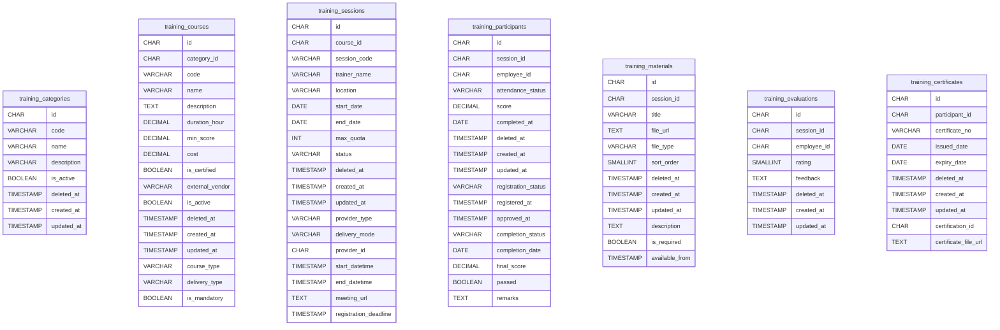


## Workforce Intelligence

| Tabel | Jumlah Kolom | FK Utama |
|---|---|---|
| `workforce_planning_headcounts` | 8 | - |
| `workforce_forecasts` | 9 | - |
| `workforce_kpis` | 11 | - |
| `workforce_analytics_cache` | 8 | - |
| `workforce_scenarios` | 11 | - |
| `workforce_risk_indicators` | 11 | - |
| `workforce_health_scores` | 13 | - |

### ERD — Workforce Intelligence

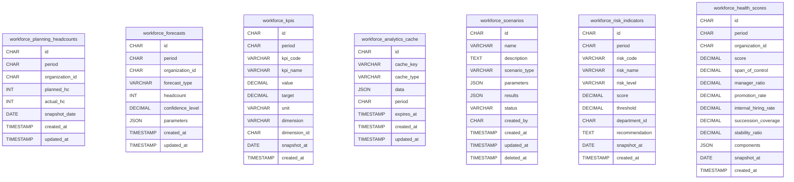


## Career Intelligence

| Tabel | Jumlah Kolom | FK Utama |
|---|---|---|
| `career_talent_maps` | 12 | - |
| `career_interests` | 12 | - |
| `career_paths` | 16 | - |
| `career_succession_plans` | 12 | - |

### ERD — Career Intelligence

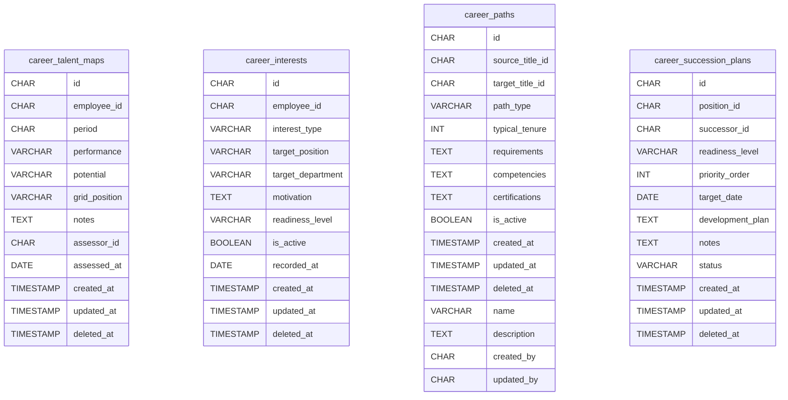


## Konvensi Kolom

| Konvensi | Keterangan |
|---|---|
| **Primary Key** | `id CHAR(36)` — UUID v4 untuk semua tabel |
| **Foreign Key** | Kolom berakhiran `_id` merujuk PK tabel lain (relasi ditampilkan di ERD) |
| **Soft Delete** | `deleted_at TIMESTAMP NULL` — record tidak dihapus fisik (kecuali tabel tertentu) |
| **Timestamps** | `created_at` & `updated_at TIMESTAMP` pada hampir semua tabel |
| **Audit** | `created_by` / `updated_by CHAR(36)` pada tabel master data |
| **Enum via VARCHAR** | Status & tipe disimpan sebagai string (mis. `status VARCHAR(20)`) |

## Migrasi & Dialect

- Migrasi tenant tersedia untuk **PostgreSQL** (`postgres/`) dan **MySQL** (`mysql/`) — 89 file up + 89 file down per dialect (356 total).
- Migrasi **platform** bersifat cross-dialect di `migrations/platform/`.
- Tabel tambahan platform (`packages`, `package_modules`) dibuat via GORM `AutoMigrate`.
- Dijalankan otomatis saat **provisioning company** (tenant DB dibuat + migrasi + seed).

### Regenerasi Dokumen

Dokumen ini di-generate dari migrasi SQL. Untuk regenerasi atau verifikasi sinkronisasi:

```bash
python scripts/generate_database_schema_doc.py   # regenerasi (tulis file)
python scripts/check_database_schema_doc.py     # verifikasi sinkron (tanpa menimpa)
```

> Verifikasi sinkronisasi mencakup **kedua dialect** (PostgreSQL & MySQL) — `check-db-docs` memastikan jumlah & daftar tabel di dokumen sama dengan migrasi `postgres/` **dan** `mysql/`.
